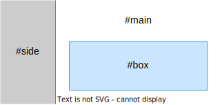

Aborting requests
=================

When two requests [target](/targeting-fragments) the same element, Unpoly will abort the earlier request.

This is to non-deterministic updates when two requests race to render the same fragment.
Note that responses may or may not arrive in the same order as they were requested.

## Controlling what's aborted

To control which requests are aborted, you may pass an `{ abort }` option to rendering functions
like `up.follow()`, `up.submit()` or `up.render()`. In your HTML you may use
an `[up-abort]` attribute with the same values.

### Don't abort anything

Pass `{ abort: false }` to not abort any request.

If two requests would target the same fragment with `{ abort: false }`, they
will be rendered in the order of their response. If the first response removes
the fragment targeted by the second request, it may cause the second request
to fail or update a [fallback target](/up.render#options.fallback).

### Aborting all requests

Pass `{ abort: 'all' }` to abort all requests targeting any fragment on any layer.

### Aborting requests on your layer

Pass `{ abort: 'layer' }` to abort all requests targeting a fragment on the same
[layer](/up.layer) as you.

### Aborting conflicting requests

The default is `{ abort: 'target' }`, which aborts earlier requests targeting
fragments within *your* targeted fragments. Requests targeting other fragments are not aborted.

To visualize the effects of `{ abort: 'target' }`, observe the layout below.
The screen is split into a sidebar (`#side`) and a content area (`#main`). Contained within
`#main` is a smaller fragment `#box`.

{:width='350'}

In this layout rendering with `{ abort: 'target' }` has the following effect:

- Concurrent requests targeting `#side` and `#main` will not abort each other.
- When two requests target `#main`, the first request will be aborted by the second request.
- Rendering `#main` will abort an earlier request targeting `#box`.
- Rendering `#box` will *not* abort an earlier request targeting `#main`.

## Preventing requests from being aborted

In some cases you may want protect a request from being aborted through `{ abort }`.\
You may do so by passing an `{ abortable: false }` option.

## Aborting imperatively

To imperatively abort requests targeting a fragment or layer, use the `up.fragment.abort()` function.

There is also a low-level `up.network.abort()` function, which aborts requests
matching arbitrary conditions.

## Reacting to aborted requests

When aborting requests using the `{ abort }` option or through `up.fragment.abort()`,
the events `up:fragment:aborted` and `up:request:aborted` are emitted.

To simplify the registration of code when a fragment or its ancestor is aborted, use `up.fragment.onAborted()`.

## Other aborting rules

Unpoly handles the following edge cases, which sometimes require requests to be aborted:

- When a fragment is removed from the DOM (by [rendering](/up.render) or explicit [destroying](/up.destroy)),
  any request targeting this fragment is aborted. This is regardless of the `{ abort }` option used.
- When a layer is closed, all pending requests targeting that layer are aborted.
  This is regardless of the `{ abort }` option used.
- The mere act of [preloading a link](/a-up-preload) does not abort pending requests. Only when actually rendering
  from a preloaded response, requests targeting the same fragment are aborted.
- When two requests attempt to [open a new layer](/a-up-layer-new), the first request will be aborted by the second request.
- A request to open a new layer is also aborted when the base layer's [main element](/main) is targeted by a second request.

@page aborting-requests
