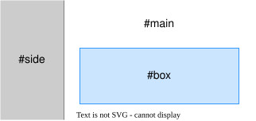

Aborting requests
=================

When two requests [target](/targeting-fragments) the same element, Unpoly aborts the earlier request.
Only the later response is rendered, regardless of the order in which responses arrive.
This prevents non-deterministic updates when two requests race to render the same fragment.


Conflicting requests are aborted {#aborting-conflicting-requests}
--------------------------------

By default, a render pass aborts earlier requests targeting fragments within *its own* targeted fragments.
Requests targeting other fragments are not aborted.

To visualize this, consider a layout with a sidebar (`#side`) and a content area (`#main`).
Contained within `#main` is a smaller fragment `#box`:

{:width='350'}

In this layout, rendering has the following effects:

- Concurrent requests targeting `#side` and `#main` do not abort each other.
- When two requests target `#main`, the first request is aborted by the second request.
- Rendering `#main` aborts an earlier request targeting `#box`.
- Rendering `#box` does *not* abort an earlier request targeting `#main`.

Other work waiting on a fragment stops as well when the fragment is aborted:
[polling](/polling) ends, and pending [validations](/validation) are dropped.


Controlling what is aborted {#controlling}
---------------------------

To control which requests are aborted, pass an [`{ abort }`](/up.render#options.abort) option to rendering functions
like `up.follow()`, `up.submit()` or `up.render()`. In your HTML, set an `[up-abort]` attribute with the same values:

```html
<a href="/dashboard" up-follow up-abort="layer">Dashboard</a> <!-- mark: up-abort="layer" -->
```

| Value | Effect |
|-------|--------|
| `'target'` | Aborts earlier requests targeting fragments within *your* targeted fragments. This is the default. |
| `'layer'` | Aborts all requests targeting a fragment on the same [layer](/up.layer) as you. |
| `'all'` | Aborts all requests targeting any fragment on any layer. |
| `false` | Aborts nothing. |

With `{ abort: false }`, two requests targeting the same fragment are rendered in the order of their responses.
If the first response removes the fragment targeted by the second request, the second request
fails or updates a [fallback target](/up.render#options.fallback).


Protecting a request from being aborted {#preventing}
---------------------------------------

To protect a request from being aborted through `{ abort }`, pass an [`{ abortable: false }`](/up.render#options.abortable) option
or set an `[up-abortable="false"]` attribute:

```html
<form method="post" action="/orders" up-submit up-abortable="false"> <!-- mark: up-abortable="false" -->
  ...
</form>
```

Submitting this form is not interrupted when the user navigates to another page while the request is loading.

[Preload](/preloading) requests are not abortable by default, so navigating does not cancel a menu
that is still preloading in the background.


Aborting from JavaScript {#aborting-imperatively}
------------------------

To abort requests targeting a fragment, pass the element or a selector to `up.fragment.abort()`:

```js
up.fragment.abort('.content')
```

To abort all requests targeting a [layer](/up.layer), pass a `{ layer }` option:

```js
up.fragment.abort({ layer: 'root' })
up.fragment.abort({ layer: 'any' }) // aborts requests on all layers
```

There is also a low-level `up.network.abort()` function, which aborts requests matching a
[URL pattern](/url-patterns) or an arbitrary condition. Prefer `up.fragment.abort()` when you can:
only requests aborted by screen region let components [react to being aborted](#reacting).


Reacting to aborted requests {#reacting}
----------------------------

When requests are aborted through `{ abort }` or `up.fragment.abort()`, an `up:fragment:aborted` event
is emitted on the element for which requests were aborted, and an `up:request:aborted` event for each aborted request.

A rendering function whose request was aborted rejects with an `up.Aborted` error.
See [handling aborted requests](/failed-responses#handling-aborted-requests).

To run code when an element *or one of its ancestors* was aborted, use `up.fragment.onAborted()`.
For example, a timer that reloads an element after 10 seconds should not fire once the element's requests were aborted:

```js
let timeout = setTimeout(() => up.reload(element), 10000)
up.fragment.onAborted(element, () => clearTimeout(timeout)) // mark: up.fragment.onAborted
```

The callback is unsubscribed automatically when the element is destroyed.


Aborting rules in layers {#layers}
------------------------

The following rules apply when opening or closing [overlays](/up.layer):

- A request to open a new overlay will abort existing requests targeting the base layer's [main element](/main) or its descendants.
- When two requests attempt to [open a new overlay](/up-layer-new) over the same base layer, the first request will be aborted by the second request.
- A request to open a new overlay is aborted when the base layer's [main element](/main) is targeted by a second request.
- When a layer is closed, all pending requests targeting that layer are aborted. This is regardless of the `{ abort }` option used.


Destroyed fragments are aborted {#destroyed}
-------------------------------

When a fragment is removed from the DOM with `up.destroy()`, any request targeting this fragment (or its descendants)
is aborted. This is regardless of the `{ abort }` option used.

A render pass that replaces a fragment also aborts requests targeting the removed elements,
unless it was given `{ abort: false }`.


@page aborting-requests
