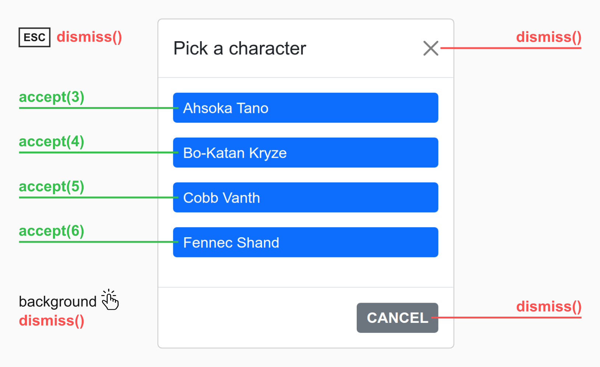

Closing overlays
================

This page explains the many different ways to close an [overlay](/up.layer) in Unpoly.

In addition to making the overlay disappear, you may also communicate a result value back
to the parent layer. This is useful to branch off a complex user interaction into an overlay,
then resume the original scenario when you're done.


Distinguishing close intents {#intents}
---------------------------------------

When closing an [overlay](/up.layer), Unpoly distinguishes between two kinds close intents:

1. **Accepting** an overlay (user picks a value, confirms with "OK", etc.), optionally with a value
2. **Dismissing** an overlay (user clicks "Cancel", "X", presses `ESC`, clicks on the background)

{:width='600'}

Accepting an overlay will usually continue a larger interaction in the parent layer.
Dismissal usually means cancelation. When you're waiting for a [subinteraction](/subinteractions)
to finish successfully you're interested layer acceptance, but not dismissal.


## Running code when an overlay closes {#callbacks}

When opening a layer you may pass separate `{ onAccepted }` and `{ onDismissed }` callbacks
to handle both [close intents](#intents):

```js
up.layer.open({
  url: '/users/new',
  onAccepted: (event) => console.log('User was created'),
  onDismissed: (event) => console.log('User creation was canceled')
})
```

Both callbacks are optional.

In HTML you may use `[up-on-accepted]` and `[up-on-dismissed]` attributes for the same purpose:

```js
<a href="/select-user"
  up-layer="new"
  up-on-accepted="console.log('User was created')"
  up-on-dismissed="console.log('User creation was canceled')">>
  ...
</a>
```

Overlay result values
---------------------

Overlays in Unpoly may be closed with an optional *result value*. The result value
is communicated back to the layer that opened the overlay. Result values can be used to
[augment a select](/subinteractions#adding-options-to-an-existing-select)
or [navigate to another screen](/subinteractions#navigating-away).


### Acceptance values

E.g. if the user selects a value, creates a record or confirms an action,
we consider the overlay to be **accepted with that value**.

You can access the acceptance value from an `{ onAccepted }` callback:

```js
up.layer.open({
  url: '/select-user',
  onAccepted: (event) => console.log('Got user', event.value)
})
```

The acceptance value may also be accessed when you're opening layers from HTML:

```html
<a href="/select-user"
  up-layer="new"
  up-on-accepted="console.log('Got user', value)">
  ...
</a>
```


### Dismissal reasons

When an overlay is dimissed, the result value can indicate the reason for dismissal.
For instance, closing an overlay by clicking on the `×` symbol will dismiss with the value `":button"`.

The reason can be accessed from an `{ onDismissed }` callback or `[up-on-dismissed]` attribute:

```html
<a href="/select-user"
  up-layer="new"
  up-on-dismissed="console.log('Dismissal reason is', value)">
  ...
</a>
```

You can provide a dismissal reason when closing an overlay using `up.layer.dismiss()` or `[up-dismiss]`.

If the overlay is closed using a [standard dismiss control](#customizing-dismiss-controls), the following
default reasons are set:

| User interaction                                    | Dismissal reason |
| --------- ------------------------------------------| ---------------- |
| User presses the `Escape` key                       | `":key"`         |
| User clicks on the background ("light dismiss")     | `":outside"`     |
| User clicks on the `×` button in the overlay corner | `":button"`      |


Close conditions
----------------

When opening an overlay, you may define a *condition* when the overlay interaction ends.
When the condition occurs, the overlay is automatically closed and a callback is run.

It is recommend to use close conditions instead of closing with explicit commands like [`up.layer.accept()`](#closing-from-javascript)
or [`X-Up-Accept-Layer`](#closing-from-the-server).
By defining a close condition, the overlay content does not need to be aware that it's running
in an overlay. The overlay interaction is decoupled from the interaction in the parent layer.


### Closing when a location is reached {#location-condition}

The following will open an overlay that closes once a URL like `/companies/123` is reached:

```html
<a href="/companies/new"
  up-layer="new"
  up-accept-location="/companies/$id"
  up-on-accepted="alert('New company with ID ' + value.id)">
  New company
</a>
```

Named segments captured by the [URL pattern](/url-patterns) (`$id`) will
become the overlay's *acceptance value*.

To *dismiss* an overlay once a given location is reached, use `[up-dismiss-location]` and `[up-on-dismissed]` in the same fashion.


### Closing when an event is emitted {#event-condition}

Instead of waiting for a location to be reached,
you may accept an overlay\
once a given **event** is observed on the overlay:

```html
<a href="/users/new"
  up-layer="new"
  up-accept-event="user:created"
  up-on-accepted="alert('Hello user #' + value.id)">
  Add a user
</a>
```

When the `user:created` event is observed within the new overlay, the event's [default action is prevented](https://developer.mozilla.org/en-US/docs/Web/API/Event/preventDefault) and the overlay is closed.
The event object becomes the overlay's acceptance value.

To *dismiss* an overlay once a given event is observed, use the `[up-dismiss-event]` and `[up-on-dismissed]` attributes in the same fashion.

To emit an event, use one of the following methods:

| Method               | Description             |
|----------------------|-------------------------|
| `up.emit()`          | JavaScript function to emit an event on any element |
| `up.layer.emit()`    | JavaScript function to emit an event on the [current layer](/up.layer.current) |
| `a[up-emit]`         | HTML attribute to emit an event on click |
| `X-Up-Events`        | HTTP header sent from the server |
| [`Element#dispatchEvent()`](https://developer.mozilla.org/en-US/docs/Web/API/EventTarget/dispatchEvent) | Standard DOM API to emit an event on an element |

When an event causes an overlay to close, its default is prevented. You can use `[up-emit]` with a [fallback URL](/up-emit#fallback)
to make a link that emits a closing event in an overlay, but navigates to a different page on the [root layer](/up.layer.root).


### Rendering discarded notification flashes

When an overlay closes in reaction to a server response, the content from that response is discarded.
Any [confirmation flashes](/flashes) would be lost.

The `[up-flashes]` element addresses this by picking up flashes from a closing overlay and
[rendering them into the parent layer](/flashes#from-closing-overlays).


### Using the discarded response

When a server response causes an overlay to closes, no content from that response is rendered.
Sometimes you need to access the discarded response, e.g. to render its content in another layer.

One way to achieve this is to use an `[up-hungry]` element with an `[up-if-layer=subtree]` attribute
on a parent layer. A matching element would be updated with the discarded response of a closing overlay.

If you need more control, you may also access response via the `{ response }` property of the `up:layer:accepted` and `up:layer:dismissed` events.

For example, the link link opens an overlay with a form to create a new company (`/companies/new`).
After successful creation the form redirects to the list of companies (`/companies`). In that case
we can use the HTML from the response and render it into the parent layer:

```html
<a href="/companies/new"
   up-layer="new"
   up-accept-location="/companies"
   up-on-accepted="up.render('.companies', { response: event.response }"> <!-- mark-phrase "event.response" -->
  New company
</a>
```

The `{ response }` property is available whenever a server response causes an overlay to close:

- When a [server-sent event](/X-Up-Events) matches a [close condition](#close-conditions).
- When the new location matches a [close condition](#close-conditions).
- When the server [explicitly closes](#closing-from-the-server) an overlay using an HTTP header.


Closing from the server explicitly {#closing-from-the-server}
-------------------------------------------------------------

If you don't want to use [close conditions](#close-conditions),
the server may explicitly close an overlay by sending an `X-Up-Accept-Layer` or `X-Up-Dismiss-Layer` header.
Optionally the header may transport a value.

When you're using the `unpoly-rails` gem, you may produce these headers with `up.layer.accept(value)` or `up.layer.dismiss(value)`.

The server may also test if the fragment change is targeting an overlay by looking at the `X-Up-Mode` header.

When an overlay closes in reaction to a server response, you can [access the discarded response](#using-the-discarded-response).


Closing from JavaScript
-----------------------

If for some reason you cannot use a [close condition](#close-conditions), you may
call `up.layer.accept()` to explicitly accept a layer from JavaScript:


```js
up.layer.accept()
```

To accept with a value, pass it as an argument:

```js
up.layer.accept({ name: 'Anna', email: 'anna@domain.tld' })
```

To *dismiss* an overlay from JavaScript, use the `up.layer.dismiss()` function in the same fashion.


Closing when an element is clicked
----------------------------------

Use an `[up-accept]` or `[up-dismiss]` attribute to close the [current layer](/up.layer.current)
when the link is clicked:

```html
<a href="/fallback" up-accept>...</a>
```

If an overlay was closed, the `click` event's [default action is prevented](https://developer.mozilla.org/en-US/docs/Web/API/Event/preventDefault)
and the link will not be followed. Only when this link is clicked in the
[root layer](/up.layer.root), there is no overlay to close and the link to `/fallback` will be followed.

To *dismiss* an overlay once an element clicked, use the `[up-dismiss]` attribute in the same fashion.


Closing by targeting the parent layer
-------------------------------------

When a link or form targets a parent layer, the current layer will [dismiss](#intents) when the parent layer is updated.
This behavior is called *peeling*.

The example below uses an [`[up-layer]` attribute](/layer-option) to update the parent layer
after a successful form submission:

```html
<form method="post" action="/users" up-layer="parent">
  <input type="text" name="email">
  <button type="submit">Create user</button>
</form>
```

A successful submission will now dismiss the form's own overlay with a [dismissal value](#overlay-result-values) of `":peel"`.


> [note]
> The form will still update its own layer when the [server responds with an error code](/failed-responses)
> due to a validation error. To target another layer in this case, set an `[up-fail-layer]` attribute.


Customizing dismiss controls
----------------------------

By default the user can dismiss an overlay user by pressing `Escape`, by clicking outside the overlay box
or by pressing an `×` icon in the top-right corner.

You may customize the dismiss methods available to the user by passing a `{ dismissable }` option
or `[up-dismissable]` attribute when opening an overlay.

The option value should contain the name of one or more dismiss controls:

| Method    | Effect                                           | Dismiss value |
| --------- |--------------------------------------------------| ------------- |
| `key`     | Enables dimissing with `Escape` key              | `":key"`      |
| `outside` | Enables dismissing by clicking on the background | `":outside"`  |
| `button`  | Adds an `×` button to the layer                  | `":button"`   |

Regardless of what is configured here, an overlay may always be dismissed by
using the `up.layer.dismiss()` method or `a[up-dismiss]` attribute.


Close animation
---------------

The overlay element's disappeared will be animated using the layer mode's [configured](/up.layer.config) `{ closeAnimation }`.

To use a different animation, pass an `{ animation }` option to the various close methods.


Using overlays as promises
--------------------------

Instead of using `up.layer.open()` and passing callbacks, you may use `up.layer.ask()`.
`up.layer.ask()` returns a [promise](https://developer.mozilla.org/en-US/docs/Web/JavaScript/Guide/Using_promises)
for the acceptance value, which you can [`await`](https://developer.mozilla.org/en-US/docs/Web/JavaScript/Reference/Operators/await):

```js
let user = await up.layer.ask({ url: '/users/new' })
console.log('Got user:', user)
```

If the overlay is dismissed instead of accepted, the promise will be rejected with the dismissal value:

```js
try {
  await up.layer.ask({ url: '/users/new' })
} catch (reason) {
  console.log('Overlay was dismissed:', reason)
}
```


@page closing-overlays
