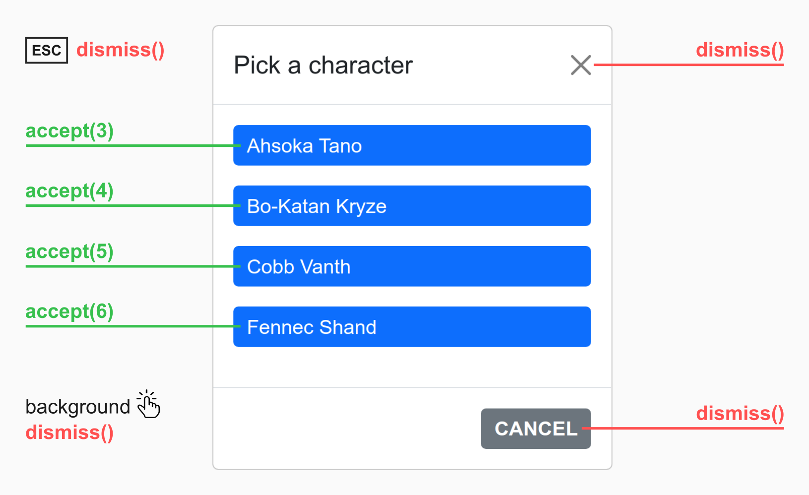

Closing overlays
================

An overlay closes when the user is done with it: by pressing `Escape`, by clicking a button,
or automatically when the overlay reaches a URL or emits an event.
When it closes, the overlay can pass a result value back to the layer that opened it,
so the original screen can continue where the user left off.


Accepting and dismissing {#intents}
------------------------

Unpoly distinguishes two intents when an overlay closes:

1. **Accepting** an overlay: the user picked a value, confirmed with *OK*, or completed their task.
   An overlay can be accepted with a value.
2. **Dismissing** an overlay: the user clicked *Cancel* or the `×` button, pressed `Escape`,
   or clicked on the background.

{:width='600'}

Acceptance usually continues a larger interaction in the parent layer, like
[selecting a record that was just created](/subinteractions).
Dismissal usually means cancellation. When you wait for a subtask to finish,
you are interested in acceptance, but not in dismissal.


Running code when an overlay closes {#callbacks}
-----------------------------------

When opening an overlay, you can pass separate `{ onAccepted }` and `{ onDismissed }` callbacks
for the two [intents](#intents):

```js
up.layer.open({
  url: '/users/new',
  onAccepted: (event) => console.log('User was created'), // mark: onAccepted
  onDismissed: (event) => console.log('User creation was canceled') // mark: onDismissed
})
```

Both callbacks are optional.

In HTML, set `[up-on-accepted]` and `[up-on-dismissed]` attributes on the link that opens the overlay:

```html
<a href="/users/new"
  up-layer="new"
  up-on-accepted="console.log('User was created')"
  up-on-dismissed="console.log('User creation was canceled')"> <!-- mark: up-on-dismissed -->
  Add user
</a>
```

Instead of passing callbacks, you can also open an overlay with `up.layer.ask()`
and `await` a promise for its result. See [[subinteractions#awaiting-subinteractions-from-javascript]].


Result values {#result-values}
-------------

An overlay can close with a *result value*. The value is passed to the layer that
opened the overlay, which can use it to continue its own interaction:
[select a new option](/subinteractions#adding-options-to-an-existing-select),
[navigate to another screen](/subinteractions#navigating-away), or reload a list.

### Acceptance values {#acceptance-values}

When the user selects a value, creates a record or confirms an action,
the overlay is *accepted with that value*.

An `{ onAccepted }` callback receives the value as `event.value`:

```js
up.layer.open({
  url: '/select-user',
  onAccepted: (event) => console.log('Got user', event.value) // mark: event.value
})
```

In an `[up-on-accepted]` attribute, the value is available as `value`:

```html
<a href="/select-user"
  up-layer="new"
  up-on-accepted="console.log('Got user', value)"> <!-- mark: value -->
  Select user
</a>
```

### Dismissal reasons {#dismissal-reasons}

When an overlay is dismissed, the result value indicates the reason for dismissal.
For instance, clicking the `×` button dismisses with the value `":button"`.

The reason is available in an `{ onDismissed }` callback or `[up-on-dismissed]` attribute:

```html
<a href="/select-user"
  up-layer="new"
  up-on-dismissed="console.log('Dismissed because of', value)"> <!-- mark: value -->
  Select user
</a>
```

You can provide your own dismissal reason when closing an overlay with `up.layer.dismiss()` or `[up-dismiss]`.
The [standard dismiss controls](#customizing-dismiss-controls) set these reasons:

| User interaction                                    | Dismissal reason |
|-----------------------------------------------------|------------------|
| User presses the `Escape` key                       | `":key"`         |
| User clicks on the background ("light dismiss")     | `":outside"`     |
| User clicks on the `×` button in the overlay corner | `":button"`      |


Close conditions {#close-conditions}
----------------

When opening an overlay, you can define a *condition* for when the overlay's task is done.
When the condition occurs, the overlay closes automatically and your callback runs.

We recommend close conditions over explicit commands like [`up.layer.accept()`](#from-script)
or [`X-Up-Accept-Layer`](#from-server). With a close condition, the overlay content does not need
to know that it is running in an overlay. The same screen works as a full page and as
a [subinteraction](/subinteractions) of another screen.


### Closing when a location is reached {#location-condition}
{:data-toc-include="true"}

To close an overlay once it reaches a URL like `/companies/123`, set an [`[up-accept-location]`](/up-layer-new#up-accept-location)
attribute with a [URL pattern](/url-patterns):

```html
<a href="/companies/new"
  up-layer="new"
  up-accept-location="/companies/$id"
  up-on-accepted="alert('New company with ID ' + value.id)"> <!-- mark: up-accept-location="/companies/$id" -->
  New company
</a>
```

When the user submits the company form and the server redirects to `/companies/123`,
the overlay is accepted. Named segments captured by the [URL pattern](/url-patterns) (`$id`) become
the overlay's [acceptance value](#acceptance-values), here `{ id: 123 }`.

A `$id` segment only matches digits, so the overlay's own URL `/companies/new` does not match the pattern.

To *dismiss* an overlay once a location is reached, use `[up-dismiss-location]` and `[up-on-dismissed]` in the same fashion.


### Closing when an event is emitted {#event-condition}
{:data-toc-include="true"}

To close an overlay once an event is observed within it, set an [`[up-accept-event]`](/up-layer-new#up-accept-event) attribute:

```html
<a href="/users/new"
  up-layer="new"
  up-accept-event="user:created"
  up-on-accepted="alert('Hello user #' + value.id)"> <!-- mark: up-accept-event="user:created" -->
  Add a user
</a>
```

When a `user:created` event is emitted within the overlay, the event's
[default action is prevented](https://developer.mozilla.org/en-US/docs/Web/API/Event/preventDefault) and the overlay is accepted.
The event object becomes the overlay's [acceptance value](#acceptance-values).

To *dismiss* an overlay once an event is observed, use `[up-dismiss-event]` and `[up-on-dismissed]` in the same fashion.

There are several ways to emit an event:

| Method            | Description             |
|-------------------|-------------------------|
| `up.emit()`       | JavaScript function to emit an event on any element |
| `up.layer.emit()` | JavaScript function to emit an event on the [current layer](/up.layer.current) |
| `[up-emit]`       | HTML attribute to emit an event on click |
| `X-Up-Events`     | HTTP header sent from the server |
| [`Element#dispatchEvent()`](https://developer.mozilla.org/en-US/docs/Web/API/EventTarget/dispatchEvent) | Standard DOM API to emit an event on an element |

Since the closing event's default is prevented, an `[up-emit]` link with a [fallback URL](/up-emit#fallback)
can close an overlay, but navigate to a different page when clicked on the [root layer](/up.layer.root).


### Closing when a fragment is detected {#fragment-condition}
{:data-toc-include="true"}

To close an overlay once an element matching a selector appears within it,
set an [`[up-accept-fragment]`](/up-layer-new#up-accept-fragment) attribute:

```html
<a href="/users/new"
  up-layer="new"
  up-accept-fragment=".user-profile"
  up-on-accepted="alert('Hello user #' + value.id)"> <!-- mark: up-accept-fragment=".user-profile" -->
  Add a user
</a>
```

When an element in the overlay matches `.user-profile`, the overlay is accepted.
The fragment's [data](/data) becomes the [acceptance value](#acceptance-values):

```html
<div class="user-profile" data-id="123"> <!-- mark: data-id="123" -->
  ...
</div>
```

If the fragment has no data, the acceptance value is an empty object (`{}`).

To *dismiss* an overlay once a fragment is detected, use `[up-dismiss-fragment]` and `[up-on-dismissed]` in the same fashion.


### Rendering discarded notification flashes

When an overlay closes in reaction to a server response, the content of that response is discarded.
Any [confirmation flashes](/flashes) in that response would be lost.

An `[up-flashes]` element picks up flashes from a closing overlay and
[renders them into the parent layer](/flashes#from-closing-overlays).


### Using the discarded response

When a server response closes an overlay, nothing from that response is rendered.
Sometimes you need the discarded response anyway, e.g. to render its content in another layer.

One way is an `[up-hungry]` element with an `[up-if-layer=subtree]` attribute in a parent layer.
Such an element is updated with the discarded response of a closing overlay.

For more control, access the response through the `{ response }` property of the `up:layer:accepted` and `up:layer:dismissed` events.

In the example below, the link opens an overlay with a form to create a new company (`/companies/new`).
After successful creation the form redirects to the list of companies (`/companies`).
That response already contains the updated list, so we render it into the parent layer
instead of making another request:

```html
<a href="/companies/new"
   up-layer="new"
   up-accept-location="/companies"
   up-on-accepted="up.render('.companies', { response: event.response })"> <!-- mark: event.response -->
  New company
</a>
```

The `{ response }` property is set whenever a server response causes an overlay to close:

- When a [server-sent event](/X-Up-Events) matches a [close condition](#close-conditions).
- When the new location matches a [close condition](#close-conditions).
- When the server [explicitly closes](#from-server) an overlay with an HTTP header.


Closing when a button is clicked {#on-click}
--------------------------------

To close the [current layer](/up.layer.current) when a button is clicked, set an `[up-accept]` or `[up-dismiss]` attribute:

```html
<button up-accept>Close overlay</button> <!-- mark: up-accept -->
```

To close with a [result value](#result-values), set the attribute to a [relaxed JSON](/relaxed-json) value:

```html
<button up-accept="{ id: 5 }">Choose user #5</button> <!-- mark: { id: 5 } -->
```


Closing when a link is followed {#on-follow}
-------------------------------

When [reusing a page within an overlay](/subinteractions#reusing-existing-screens),
you may want a link that closes the overlay, but navigates somewhere else when clicked on the root layer.

For this, set `[up-accept]` or `[up-dismiss]` on a hyperlink (`<a>`) with a fallback URL in its `[href]` attribute:

```html
<a href="/list" up-accept>Finish</a> <!-- mark: href="/list" -->
```

Clicked in an overlay, the link accepts the overlay and the `click` event is prevented.
Clicked on the [root layer](/up.layer.root), the link navigates to `/list`.


Closing when a form is submitted {#on-submit}
--------------------------------

To close an overlay when a form is submitted, set an `[up-accept]` or `[up-dismiss]` attribute on the `<form>` element.
The overlay closes immediately on submission, without a network request:

```html
<form up-accept> <!-- mark: up-accept -->
  ...
</form>
```

### Accessing the form params

The form's field values become the [result value](#result-values) of the closed overlay.

For example, this form has two fields named `foo` and `bar`:

```html
<form up-accept>
  <input name="foo" value="1"> <!-- mark: foo -->
  <input name="bar" value="2"> <!-- mark: bar -->
</form>
```

The params are exactly those a [regular submission](/up.Params.fromForm) would send, so a
[submit button](/up.Params.fromForm#submit-button) with a `[name]` also contributes its value.
This lets the opener see *which* button was pressed:

```html
<form up-accept>
  <button type="submit" name="commit" value="save">Save</button> <!-- mark: commit -->
  <button type="submit" name="commit" value="publish">Publish</button>
</form>
```

The values arrive as an `up.Params` object in your `{ onAccepted }` or `{ onDismissed }` callback:

```js
up.layer.open({
  url: '/form',
  onAccepted: ({ value }) => {
    console.log(value.get('foo')) // result: "1"
    console.log(value.get('bar')) // result: "2"
  }
})
```

### Regular submission on the root layer

When a form with `[up-accept]` or `[up-dismiss]` is submitted within an overlay, the `submit` event
is prevented and no request is made.

When the same form is submitted on the root layer, there is no overlay to close.
The form is then submitted regularly, e.g. with a `POST` request.
This lets you [reuse an existing form within an overlay](/subinteractions#reusing-existing-screens).

### Closing after the submission request

When the form should make its request *before* the overlay closes, do *not* set
an `[up-accept]` or `[up-dismiss]` attribute. Make a regular form that is handled by Unpoly instead:

```html
<form up-submit> <!-- mark: up-submit -->
  ...
</form>
```

After the server has processed the request, it can close the overlay in several ways:

- Redirecting to a [location that is a close condition](#location-condition)
- Emitting an [event that is a close condition](#event-condition)
- Sending a [response header that closes the overlay](#from-server)


Closing from JavaScript {#from-script}
-----------------------

When you cannot use a [close condition](#close-conditions), call `up.layer.accept()`
to accept the [current layer](/up.layer.current):

```js
up.layer.accept()
```

To accept with a [result value](#result-values), pass it as an argument:

```js
up.layer.accept({ name: 'Anna', email: 'anna@domain.tld' })
```

To *dismiss* an overlay from JavaScript, use `up.layer.dismiss()` in the same fashion.


Closing from the server {#from-server}
-----------------------

When you cannot use a [close condition](#close-conditions),
the server can close the targeted overlay by sending an `X-Up-Accept-Layer` or `X-Up-Dismiss-Layer` response header.
The header value is the [result value](#result-values) as [relaxed JSON](/relaxed-json), or `null` for no value:

```http
Content-Type: text/html
X-Up-Accept-Layer: { id: 123 }

<html>
  ...
</html>
```

With the `unpoly-rails` gem, you can produce these headers with `up.layer.accept(value)` or `up.layer.dismiss(value)`.

The server can check whether a request targets an overlay by looking at the `X-Up-Mode` request header.

When an overlay closes in reaction to a server response, you can [access the discarded response](#using-the-discarded-response).


Closing by targeting a background layer {#peeling}
---------------------------------------

When a link or form in an overlay targets a background layer, the overlay
is [dismissed](#intents) once the background layer is updated. This behavior is called *peeling*.

The form below uses an [`[up-layer]`](/layer-option) attribute to update the parent layer
after a successful submission:

```html
<form method="post" action="/users" up-submit up-layer="parent"> <!-- mark: up-layer="parent" -->
  <input type="text" name="email">
  <button type="submit">Create user</button>
</form>
```

A successful submission dismisses the form's own overlay with a [dismissal reason](#dismissal-reasons) of `":peel"`.

> [note]
> The form still updates its own layer when the [server responds with an error code](/failed-responses)
> due to a validation error.\
> To update another layer in this case, set an [`[up-fail-layer]`](/up-follow#up-fail-layer) attribute.


### Accepting peeled overlays

By default, peeled overlays are [dismissed](#intents). To [accept](#intents) them instead, set an `[up-peel="accept"]` attribute
on the link or form that targets the background layer:

```html
<form method="post" action="/users" up-submit up-layer="parent" up-peel="accept"> <!-- mark: up-peel="accept" -->
  ...
</form>
```


Customizing dismiss controls
----------------------------

By default the user can dismiss an overlay by pressing `Escape`, by clicking outside the overlay box
or by clicking the `×` button in the top-right corner.

To change which of these controls are available, pass a `{ dismissible }` option
or `[up-dismissible]` attribute when opening the overlay. The link below opens an overlay that
has a close button (`×`), but cannot be dismissed by pressing `Escape` or clicking on the background:

```html
<a href="/terms" up-layer="new" up-dismissible="button">Show terms</a> <!-- mark: up-dismissible="button" -->
```

The following control names are available:

| Control name | Effect                                           | Dismissal reason |
|--------------|--------------------------------------------------|------------------|
| `key`        | Enables dismissing with the `Escape` key         | `":key"`      |
| `outside`    | Enables dismissing by clicking on the background | `":outside"`  |
| `button`     | Adds a close button (`×`) to the layer           | `":button"`   |

To enable multiple dismiss controls, separate their names with a comma or space:

```html
<a href="/terms" up-layer="new" up-dismissible="button key">Show terms</a> <!-- mark: up-dismissible="button key" -->
```

Regardless of which dismiss controls are enabled, an overlay can always be dismissed with
`up.layer.dismiss()` or an `[up-dismiss]` element.


### Customizing the dismiss icon

Most overlay modes have a button (`×`) in the top-right corner that dismisses the overlay.

You can change the symbol and accessibility label for that button:

```js
up.layer.config.overlay.dismissLabel // result: '×'
up.layer.config.overlay.dismissARIALabel // result: 'Dismiss dialog'
```


Close animation
---------------

When an overlay closes, its element disappears with the `{ closeAnimation }` [configured](/up.layer.config) for its mode.

To use a different animation for one overlay, set an `[up-close-animation]` attribute or pass a `{ closeAnimation }` option
when opening it. You can also pass an `{ animation }` option to `up.layer.accept()` or `up.layer.dismiss()`,
or set an `[up-animation]` attribute on an `[up-accept]` or `[up-dismiss]` element.


@page closing-overlays
@signature
