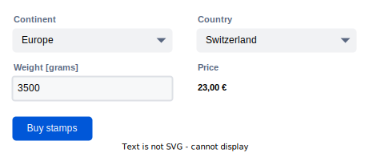

Dependent fields
================

Using the `[up-validate]` attribute you can implement forms where the state of some fields
depende on the value of other fields.  

Declaring dependencies
----------------------

This is a form to purchase postage for international parcels: 

{:width='625'}

The fields in this form have many dependencies between them:

- When the continent is changed, the country select must update to list countries from the selected continent.
- When the country is changed, the price preview must update.
- When the parcel weight is changed, the price preview must update.

We can implement this form with three `[up-validate]` attributes and no additional JavaScript:

```html
<form method="post" action="/purchases">
  <fieldset>
    <label for="content">Continent</label>
    <select name="continent" id="continent" up-validate="#country">...</select> <!-- mark-word: up-validate -->
  </fieldset>
  
  <fieldset>
    <label for="country">Country</label>
    <select name="country" id="country" up-validate="#price">...</select> <!-- mark-word: up-validate -->
  </fieldset>
  
  <fieldset>
    <label for="weight">Weight</label>
    <input name="weight" id="weight" up-validate="#price"> kg <!-- mark-word: up-validate -->
  </fieldset>
  
  <fieldset>
    <label for="price">Price</label>
    <output id="price">23 €</output>
  </fieldset>

  <button>Buy stamps</button>
</form>
```

When a field is changed, Unpoly will automatically submit the form with an additional `X-Up-Validate`
HTTP header. Upon seeing this header, the server is expected to render a new form state from its current
form values. See [this example](/up-validate#example) for control flow on the server.

When the server responds with the re-rendered form state, Unpoly will update the
[target selector](/targeting-fragments) from the changed field's `[up-validate]` attribute.
For instance, when the continent is field is changed, the country field is updated.


Multiple dependent fragments
-------------------------------------

A field with `[up-validate]` may [update multiple fragments](/targeting-fragments#updating-multiple-fragments)
by separating their target selectors with a comma.

For instance, when the user changes the continent, the following would update the price preview
in addition to the country select:

```html
<select name="continent" up-validate="#country, #price">
  ...
</select>
```

Preventing race conditions
--------------------------

Custom implementations of dependent fields will often exhibit race conditions, e.g. when the user
is quickly changing fields while requests are still in flight.

Such issues are solved with `[up-validate]`. The form will eventually show a consistent state,
regardless of how fast the user clicks or how slow the network is. In particular:

- Unpoly guarantees only a single validation request is in flight concurrently (per form).
  Additional validations are queued until the current validation request has loaded.
- Multiple updates from `[up-validate]` or `up.validate()`
  are [batched](/up.validate#batching) into a single request with multiple targets.
- If the user submits the form while validation requests are still in flight,
  the validation requests are [aborted](/aborting-requests).

Let's walk through a challenging scenario using the [postage form example](/#declaring-dependencies) above:

- User selects a continent. A request for the country select is sent, but takes a while to load.
- User inputs a parcel weight. Because a request is still in flight, no additional request is sent.
- User changes continent again. While a request is still in flight, no additional request is sent.
- The response is received. The country select is updated.
- A request for the the country select and price preview is sent.
- The next response is received. The price preview and country select are updated.

Once the last response is processed, all fields and the price preview show consistent values.

### Disabling fields during validation

If you prefer to completely prevent user input during validation, give the form an
`[up-watch-disable]` attribute. This will disable all form fields while validation requests are in flight: 

```html
<form method="post" action="/purchases" up-watch-disable> <!-- mark-word: up-watch-disable -->
  ...
</form>
```

You may also assign `[up-watch-disable]` to individual fields, or any element that contains fields.

Also see [disabling fields while processing](/watch-options#disabling-fields-while-processing).

@page dependent-fields
