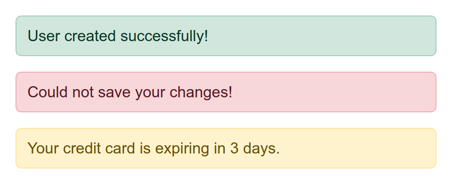

Notification flashes
====================

Use an `[up-flashes]` element to show confirmations, alerts or warnings.

{:width='480'}


Placing flashes into the layout {#placement}
-------------------------------

In your application layout, place an empty element with an `[up-flashes]` attribute. This indicates where future flash messages
should be inserted.

A popular place for flashes is outside your [main element](/main):

```html
<nav>
  Navigation items ...
</nav>
<div up-flashes></div> <!-- mark-line -->
<main>
  Main page content ...
</main>
```


### Flashes inside the main element

For styling reasons you may also wish to place the `[up-flashes]` container inside your [main element](/main):

```html
<nav>
  Navigation items ...
</nav>
<main>
  <div up-flashes></div> <!-- mark-line -->
  
  Main page content ...
</main>
```

Not that this may cause a second `[up-flashes]` element
when you open an overlay. In that case flashes from overlay content will be rendered into
the overlay preferrably. Only when the overlay is closing, its
[flashes will be rendered into the parent layer](#from-closing-overlays) (instead of being discarded).


Rendering flash messages
------------------------

To render a flash message, include an `[up-flashes]` element in your response.
The element's content should be the messages you want to render:

```html
<div up-flashes>
  <strong>User was updated!</strong>
</div>

<main>
  Main response content ...
</main>
```

### Flashes are targeted automatically

The flashes will always be updated, even if they aren't [targeted](/targeting-fragments) directly.
In the example above, rendering `main` would also update the `[up-flashes]` element.


### Flashes from closing overlays are shown on the parent layer {#from-closing-overlays}

Sometimes a fragment update will cause an overlay to [close](/closing-overlays), e.g. when a
[close condition](/closing-overlays#close-conditions) is reached. In that case no new elements
will be rendered into the closing overlay. Any confirmation flashes would be lost.

The `[up-flashes]` element addresses this by picking up flashes from a closing overlay and rendering
them into the parent layer.


Clearing flashes
----------------

By default flash messages are shown until they are replaced by new messages.
An [empty](/up.element.isEmpty) `[up-flashes]` element will not clear existing messages.

Typically you want to clear flash messages after some time.
This [compiler](/up.compiler) removes child elements of your `[up-flashes]` container after 7 seconds: 

```js
up.compiler('[up-flashes] > *', function(message) {
  setTimeout(() => up.destroy(message), 7000)
})
```

> [important]
> We're only removing the contents of `[up-flashes]`, but not the container itself.
> The empty flashes container must remain in the layout to indicate where future flashes should be [placed](#placement).


@page flashes
