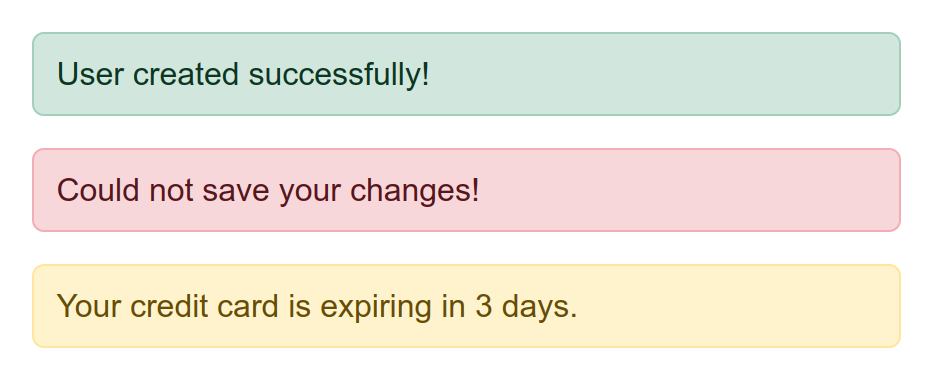

Notification flashes
====================

Unpoly can show confirmations, errors or warnings from your server responses in a
notification area. An `[up-flashes]` element in your layout is updated with every response
and keeps its messages until new ones arrive.

{:width='480'}


Placing flashes into the layout {#placement}
-------------------------------

In your application layout, place an empty element with an `[up-flashes]` attribute.
This indicates where future flash messages should be inserted.

A popular place for flashes is outside your [main element](/main):

```html
<nav>
  Navigation items ...
</nav>
<div up-flashes></div> <!-- mark-line -->
<main>
  Main page content ...
</main>
```

You may also place the container inside your main element.
See [flashes in overlays](#overlays) for how that choice affects pages with overlays.


Rendering flash messages
------------------------

To render a flash message, include an `[up-flashes]` element in your response.
The element's content should be the messages you want to render:

```html
<div up-flashes>
  <strong>User was updated!</strong> <!-- mark-line -->
</div>

<main>
  Main response content ...
</main>
```

### Flashes are targeted automatically

The flashes are always updated, even if they aren't [targeted](/targeting-fragments) directly.
In the example above, rendering `main` would also update the `[up-flashes]` element.

This works like a [hungry element](/up-hungry): the container piggy-backs on every
render pass in its layer. You don't need to name it in any `[up-target]` attribute.


Clearing flashes
----------------

By default flash messages are [kept](/up-keep) until they are replaced by new messages.

An [empty](/up.element.isEmpty) `[up-flashes]` element will **not** clear existing messages.
Hence it is safe to always include an empty `[up-flashes]` element in your application layout
to indicate where future flashes should be placed.


### Removing messages after a delay {#clearing-after-delay}

Typically you want to clear flash messages after some time.
This [compiler](/enhancing-elements) removes child elements of your `[up-flashes]` container after 5 seconds:

```js
up.compiler('[up-flashes] > *', function(message) {
  setTimeout(() => up.destroy(message), 5000)
})
```

> [important]
> We're only removing the contents of `[up-flashes]`, but not the container itself.
> The empty flashes container must remain in the layout to indicate where future flashes should be [placed](#placement).

To animate the removal, pass an [`{ animation }`](/up.destroy#options.animation) option to `up.destroy()`.


Flashes in overlays {#overlays}
-------------------

When you [open an overlay](/opening-overlays), its content is rendered from a server response
like any other fragment. Where flash messages from that response appear depends on
where your `[up-flashes]` containers are.

### One container for all layers

With the container [outside the main element](#placement), only the root layer has an
`[up-flashes]` element. Flashes from any overlay are rendered into that one container,
on the root layer.

### One container per layer

For styling reasons you may also wish to place the `[up-flashes]` container inside your [main element](/main):

```html
<nav>
  Navigation items ...
</nav>
<main>
  <div up-flashes></div> <!-- mark-line -->

  Main page content ...
</main>
```

Each overlay that renders a main element then brings its own `[up-flashes]` container.
Flash messages from overlay content are rendered into the overlay's own container.
Only when the overlay is closing, its
[flashes are rendered into the parent layer](#from-closing-overlays) instead of being discarded.


### Flashes from closing overlays are shown on a parent layer {#from-closing-overlays}

Sometimes a fragment update will cause an overlay to [close](/closing-overlays), e.g. when a
[close condition](/closing-overlays#close-conditions) is reached. In that case no new elements
will be rendered into the closing overlay. Any confirmation flashes from the final overlay interaction
would be lost.

The `[up-flashes]` element addresses this by picking up flashes from a closing overlay and rendering
them into the parent layer.


Caching considerations {#caching}
---------------------------------

Responses with notification flashes don't [cache](/caching) well.
When such a response is re-used, old flash messages will be shown again.

There are several workarounds for this:

1. Do not cache responses with flashes.
2. Have a [compiler suppress flash messages](#suppressing-cached-flashes) that have been shown before.
3. Use a different URL for responses with flashes, such as `/users/3?updated=true`.
4. Transport flash messages in a client-readable cookie instead.


### Suppressing cached flashes {#suppressing-cached-flashes}

You can write a [compiler](/enhancing-elements) that removes the DOM elements for flashes that have already been shown.
This allows you to keep caching responses with flashes, but only show each message once.

To give each flash message an identity that we can track, render it with a random attribute, such as `[data-nonce]`:

```html
<div up-flashes>
  <strong data-nonce="6792525983">User was updated!</strong> <!-- mark: data-nonce="6792525983" -->
</div>
```

The client can now track which nonces it has already seen. When a cached response is re-used,
it recognizes an older nonce and removes the message element:

```js
let seen = new Set()

up.compiler('[up-flashes] > *', function(message, { nonce }) {
  if (seen.has(nonce)) {
    // Remove a flash message that has already been shown
    message.remove()
  } else {
    // Remember that we've seen this flash message
    seen.add(nonce)

    // Only track the last 100 nonces
    if (seen.size > 100) {
      seen.delete(seen.values().next().value)
    }
  }
})
```

Because compilers run before the browser paints, removed flash messages will never
be visible to the user.


Building a custom flashes container
-----------------------------------

If you cannot work with the behavior of `[up-flashes]`, consider building your own custom flashes container.

You can use the implementation of `[up-flashes]` as a template, which looks like this:

```html
<div
  id="flashes"
  role="alert"
  up-hungry
  up-if-layer="subtree"
  up-keep
  up-on-keep="if (!up.element.isEmpty(event.newFragment)) event.preventDefault()"
>
</div>
```

The [`[up-hungry]`](/up-hungry) attribute makes the container update with every render pass.
Its [`[up-if-layer="subtree"]`](/up-hungry#up-if-layer) setting also catches updates from overlays,
which is how [flashes from a closing overlay](#from-closing-overlays) reach the parent layer.
The [`[up-keep]`](/up-keep) attribute keeps existing messages, but the [`[up-on-keep]`](/up-keep#up-on-keep)
callback lets a non-empty container replace them.

@page flashes
@signature
