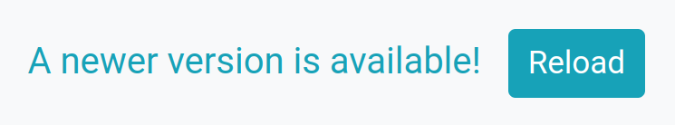

Handling changes in frontend code
=================================

When rendering new fragments, Unpoly compares scripts and stylesheets in the `<head>`
and emits an [event](/up:assets:changed) if anything changed.

It is up to your code to [handle new asset versions](#handling-changed-assets),
e.g. by [notifying the user](#notifying-the-user) or [loading new assets](#loading-new-assets).


## Tracking assets

To detect changes in your frontend code, Unpoly must track your application's *assets*.
By default an *asset* is either a script or a stylesheet with a remote source.

In the example document below, the highlighted elements are considered to be *assets*:

```html
<html>
  <head>
    <title>AcmeCorp</title>
    <link rel="stylesheet" href="/assets/frontend-5f3aa101.css"> <!-- mark-line -->
    <script src="/assets/frontend-81ba23a9.js"></script> <!-- mark-line -->
    <script>console.log('loaded!')</script>
    <link rel="canonical" href="https://example.com/dresses/green-dresses">
  </head>
  <body>
    ...
  </body>
</html>
```

Note how the inline `<script>` is not considered an asset by default.
See `[up-asset]` for ways to include or exclude elements for asset tracking.


## Handling new asset versions {#handling-changed-assets}

When [rendering](/up.render), Unpoly compares the current assets on the page with the new assets
from the server response. If the assets don't match, an `up:assets:changed` event is emitted.

**There is no default behavior when assets have changed.**
In particular no asset elements from the response
are updated in the current page. It is up to the developer to observe the `up:assets:changed` event and
implement a behavior that fits their app. 

Below you can find some popular ways to handle new asset versions.


### Notifying the user of new app versions {#notifying-the-user}

A friendly way to handle new asset version is to show a notification banner informing that a new app version is available.
The user can then choose to reload at their convenience, by clicking on the notification:

{:width='305'}

The code below inserts a clickable `<div id="new-version">` banner when assets change:

@include new-asset-notification-example

> [tip]
> The code snippet uses the `up.element.affix()` function to quickly create a DOM element from a CSS selector.


### Reloading the app at the next opportunity

An invisible way to handle new app versions if to make a full page load when the user follows
the next link. This will unload all scripts and stylesheets, and reload your app from scratch.

```js
let assetsChanged = false

up.on('up:assets:changed', function() {
  assetsChanged = true
})

up.on('up:link:follow', function(event) {
  if (assetsChanged && isLoadPageSafe(event.renderOptions)) {
    // Prevent the render pass
    event.preventDefault()

    // Make full page load without Unpoly
    up.network.loadPage(event.renderOptions)
  }
})

function isLoadPageSafe({ url, layer, method }) {
  // Default to 'GET' and uppercase the method string
  let isSafeRequest = url && up.util.normalizeMethod(method) === 'GET'

   // To prevent any overlays from closing, we only make a full page load
   // when the link is changing the root layer.
  let isRootLayer = up.layer.current.isRoot() && layer !== 'new'

   return isSafeRequest && isRootLayer
}
```


### Loading new assets

The `up:assets:changed` event has `{ oldAssets, newAssets }` properties that you can use to manually
insert the new assets into the page.

A major challenge here is that JavaScript cannot be unloaded by removing its `<script>` tag. There are three ways to work around this:

1. Scripts must be idempotent, e.g. by detecting whether they have run before. This requires a change to many of your scripts,
   and is impractical for external libraries.
2. We must avoid re-inserting existing scripts.

The solution below will go with the latter and only insert scripts that we haven't seen before. 

#### Version hash conventions

If we want to match assets by their URL, we must solve another challenge.
Asset paths often contain a version hash to allow heavy caching, e.g. `application-c80fd51c.js`.
This makes is harder to re-identify a script that was changed between two render passes.

Different bundlers have different conventions for version hashes.
Here are some examples we have seen in the wild:

| Bundler    | Path example                      | Comment                       |
|------------|-----------------------------------|-------------------------------|
| Webpack    | `/assets/application-4a83f506.js` | dash and lowercase hexdecimal |
| esbuild    | `/assets/application-C2AU6HVK.js` | full alphabet but uppercase   |
| Vite       | `/assets/application.5753e9b0.js` | dot and lowercase hexdcimal   |
| Sprockets  | `/assets/application-c80fd51c.js` | dash and lowercase hexdecimal |
| No hash    | `/assets/application.js`          |                               |

Note that the id/version separators (like `.` or `-`) are often configurable, but
most examples choose dots or dashes.


#### Example implementation

The code below will append new assets to the page `<head>` unless they are already appended.
It ignores version hashes from asset paths, so changed assets are not re-inserted.


```js
up.on('up:assets:changed', function({ oldAssets, newAssets }) {
  for (let newAsset of newAssets) {
    if (!isAssetLoaded(oldAssets, newAsset)) {
      document.head.append(newAsset)
    }
  }
})

/*
Returns whether the given `newAsset` has a match in the given `oldAssets` array.

If an existing asset has the same base name, but a different content hash,
it is still be considered to be "loaded".
*/
function isAssetLoaded(oldAssets, newAsset) {
  return oldAssets.find(function(oldAsset) {
    return getPathWithoutHash(oldAsset) === getPathWithoutHash(newAsset)
  })
}

/*
Return the given asset's path with its hash removed, e.g. "app.js" from "app.344af1ca.js".
*/
function getPathWithoutHash(asset) {
  // It's <script src="app.js"> but <link rel="stylesheet" href="app.css">
  const path = asset.src || asset.href
  const hashedPathPattern = /^(.+)[\.\-]([a-f0-9]+|[A-Z0-9]+)(\.\w+)$/
  const [match, base, hash, extension] = hashedPathPattern.exec(path)
  return match ? (base + extension) : path
}
```

## Detecting new versions without a user interaction

If you want to detect asset changes without a user interaction, use [polling](/up-poll)
to reload an empty fragment every few minutes.

This will reload an empty fragment `#version-detector` from a URL `/version` every 2 minutes:

```html
<div id="version-detector" up-poll up-interval="120_000" up-source="/version"></div>
```

## Detecting changes in backend code

You can configure Unpoly to also emit the `up:asset:changed` event after a new version of your backend code was deployed.

See [Tracking the backend version](/up-asset#tracking-backend-versions) for details.


@page handling-asset-changes
