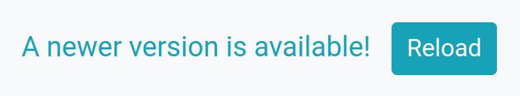

Reacting to new deployments
===========================

After you deploy a new version of your app, users with an open page keep running the old JavaScript and CSS,
since Unpoly updates fragments instead of loading new pages. Unpoly detects new asset versions in server responses
and emits an event, so you can prompt the user to reload, reload at the next opportunity, or load the new files.


Detecting a new version {#tracking-assets}
-----------------------

Unpoly tracks your application's *assets*: by default every script or stylesheet with a remote source in the `<head>`.
In the document below, the highlighted elements are assets:

```html
<html>
  <head>
    <title>AcmeCorp</title>
    <link rel="stylesheet" href="/assets/frontend-5f3aa101.css"> <!-- mark-line -->
    <script src="/assets/frontend-81ba23a9.js"></script> <!-- mark-line -->
    <script>console.log('loaded!')</script>
    <link rel="canonical" href="https://example.com/dresses/green-dresses">
  </head>
  <body>
    ...
  </body>
</html>
```

Whenever Unpoly renders a response with a `<head>`, it compares the assets on the current page
with the assets in the response. After a deployment, the fingerprinted file names differ,
and Unpoly emits an `up:assets:changed` event on the `document`:

```js
up.on('up:assets:changed', function(event) {
  console.log('A new version was deployed')
})
```

**There is no default behavior when assets have changed.** In particular, Unpoly does not insert
the new asset elements into the current page. The sections below show popular ways to react.

To include elements like inline scripts or `<meta>` tags, mark them with an `[up-asset]` attribute.
To exclude an asset, set `[up-asset="false"]`. See `[up-asset]` for details.


Notifying the user {#notifying-the-user}
------------------

A friendly way to handle a new version is a notification banner, offering to reload the page.
The user can reload at their convenience, without losing their work:

{:width='305'}

The code below inserts a clickable `#new-version` banner when assets change:

@include new-asset-notification-example

> [tip]
> The code uses `up.element.affix()` to quickly create a DOM element from a CSS selector.


Reloading at the next navigation {#reloading-at-next-navigation}
--------------------------------

An invisible way to handle a new version is to make a full page load when the user follows the next link.
This unloads all scripts and stylesheets and boots the app from scratch:

```js
let assetsChanged = false

up.on('up:assets:changed', function() {
  assetsChanged = true
})

up.on('up:link:follow', function(event) {
  if (assetsChanged && isLoadPageSafe(event.renderOptions)) {
    // Prevent the render pass
    event.preventDefault()

    // Make a full page load without Unpoly
    up.network.loadPage(event.renderOptions)
  }
})

function isLoadPageSafe({ url, layer, method }) {
  // Default to 'GET' and uppercase the method string
  let isSafeRequest = url && up.util.normalizeMethod(method) === 'GET'

  // To prevent any overlays from closing, we only make a full page load
  // when the link is changing the root layer.
  let isRootLayer = up.layer.current.isRoot() && layer !== 'new'

  return isSafeRequest && isRootLayer
}
```


Loading new assets {#loading-new-assets}
------------------

The `up:assets:changed` event has `{ oldAssets, newAssets }` properties
that you can use to insert the new assets yourself.

The code below replaces all `<link rel="stylesheet">` elements whenever they change:

```js
function isStylesheet(asset) {
  return asset.matches('link[rel=stylesheet]')
}

up.on('up:assets:changed', function({ oldAssets, newAssets }) {
  let oldStylesheets = up.util.filter(oldAssets, isStylesheet)
  for (let oldStylesheet of oldStylesheets) {
    oldStylesheet.remove()
  }

  let newStylesheets = up.util.filter(newAssets, isStylesheet)
  for (let newStylesheet of newStylesheets) {
    document.head.append(newStylesheet)
  }
})
```

Scripts cannot be swapped in the same way. Removing a `<script>` element does not unload
its code, so a new script version would run next to the old one.
Handle script changes with one of the other techniques on this page.


Detecting a new version without user interaction {#polling}
------------------------------------------------

Unpoly only compares assets when it renders a response. To detect a deployment
while the user is idle, [poll](/polling) an empty fragment every few minutes:

```html
<div id="version-detector" up-poll up-interval="120_000" up-source="/version"></div>
```

This reloads the `#version-detector` element from `/version` every two minutes.
The `/version` route must render a full HTML page with your assets in the `<head>`
and an empty `<div id="version-detector">` in the `<body>`.


Detecting a new backend version {#backend-versions}
-------------------------------

A deployment may only change backend code, leaving the frontend assets untouched.
To detect such a deployment, render the deployed commit hash in a `<meta>` tag
and mark it as an asset with `[up-asset]`:

```html
<meta name="backend-version" content="d50c6dd629e9bbc80304e14a6ba99a18c32ba738" up-asset> <!-- mark: up-asset -->
```

When the hash changes, `up:assets:changed` is emitted like for any other asset.


Aborting the render pass {#aborting}
------------------------

The `up:assets:changed` event is emitted after the response was loaded, but before any fragment is changed
and before the browser history is updated. If you cannot allow rendering with changed assets,
call `event.preventDefault()`. The render pass is then aborted and no elements are changed.

@page handling-asset-changes
@signature
