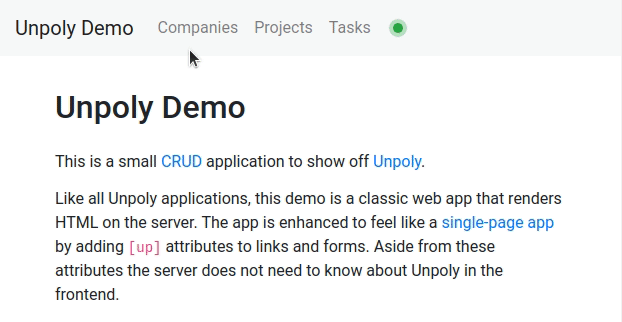

Loading state
=============

Unpoly offers many tools to show loading state after a user interaction.

This is an overview of all available strategies to signal that the app is working,
or to provide clues for how the page will ultimately look.


Styling loading elements
------------------------

Unpoly adds CSS classes to interactive elements that are loading content,
and to the fragments they are targeting:

```html
<a href="/bar" up-target="#target" class="up-active">Bar</a> <!-- mark: up-active -->

<div id="target" class="up-loading"> <!-- mark: up-loading -->
  Initial content
</div>
```

See [Feedback classes](/feedback-classes) for details and examples.


Showing placeholders
--------------------

Placeholders are temporary spinners or UI skeletons shown while a fragment is loading:

```html
<a href="/path" up-target="#target" up-placeholder="Loading…">Show story</a> <!-- mark: Loading… -->

<div id="#target">
  Loading… <!-- mark: Loading… -->
</div>
```

See [Placeholders](/placeholders) for details and examples.


Arbitrary status effects
------------------------

Using previews you can make arbitrary page changes while waiting for a network request.

```js
up.preview('link-spinner', function(preview) {
  let link = preview.origin
  preview.insert(link, '')
})
```

When the request ends for any reason, all preview changes will be reverted before
the server response is processed. This ensures a consistent screen state in cases when
a request is aborted, or when we end up updating a different fragment.

See [Previews](/previews) for details and examples.


Optimistic rendering
--------------------

Optimistic rendering is an advanced pattern where we update the page
without waiting for the server. When the server eventually does respond, the optimistic change
is reverted and replaced by the server-confirmed content.

See [Optimistic rendering](/previews) for details and examples.


Disabling forms while working
------------------------------

Unpoly lets you disable fields and buttons while a form is submitting:

```html
<form up-submit up-disable action="/session"> <!-- mark: up-disable -->
  <input type="text" name="email">        <!-- will be disabled -->
  <input type="password" name="password"> <!-- will be disabled -->
  <button type="submit">Sign in</button>  <!-- will be disabled -->
</form>
```

See [Disabling forms while working](/disabling-forms) for details and examples.


Global progress bar
-------------------

When requests are taking long to load, Unpoly will show a thin progress bar at the top edge of the screen:



This mimics similar loading indicators by browsers, which only appear during full page loads.

See [Progress bar](/progress-bar) for details and examples.


Signaling severe network problems
---------------------------------

Unpoly provides events to handle network issues like disconnects or flaky connections:

```js
up.on('up:fragment:offline', function(event) { // mark: up:fragment:offline
  if (confirm('You are offline. Retry?')) event.retry()
})
```

See [Handling network issues](/network-issues) for details and examples.


@page loading-state
