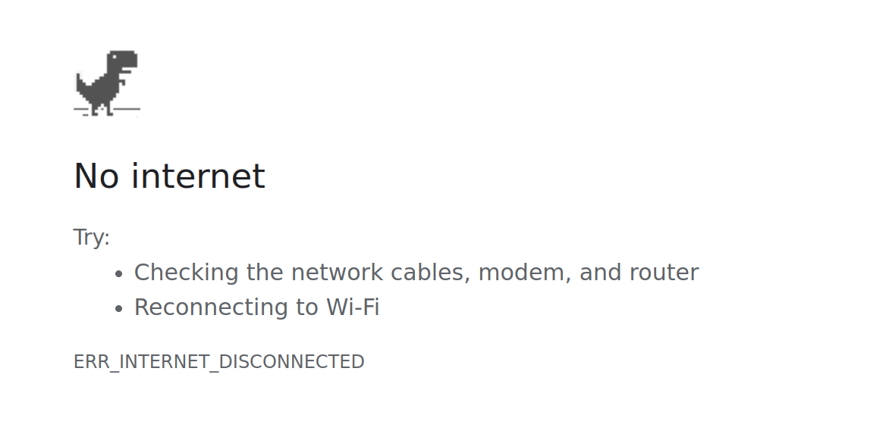

Handling network issues
=======================

Unpoly lets you handle many types of connection problems.
The objective is to keep your application accessible as the user's connection becomes [slow](#low-bandwidth), [flaky](#flaky-connections) or [goes away entirely](#disconnects).


Disconnects
-----------

In a vanilla HTML document, clicking a link while offline will replace your app with a standard error screen, no questions asked:

{:width='500'}

Interacting with an Unpoly-enhanced [link](/a-up-follow) or [form](/form-up-submit) while offline will *not* change the page. Instead Unpoly lets you define your own disconnect handling. E.g. you may choose to display an error, or to offer a button that retries the failed request.

To handle connection loss, pass an `{ onOffline }` option or set an `[up-on-offline]` attribute. When the device gets disconnected before or during a request, the callback is called with an `up:fragment:offline` argument:

```html
<a href="/path" up-follow up-on-offline="if (confirm('Retry?') event.retry()">
  Post bid
</a>
```

You may also configure a global handler that listens to `up:fragment:offline`:

```js
up.on('up:fragment:offline', function(event) {
  if (confirm('Retry?')) event.retry()
})
```

You may also do something other than retrying, like substituting content:

```js
up.on('up:fragment:offline', function(event) {
  up.render(event.renderOptions.target, { content: "You are offline." })
})
```


### Expired pages remain accessible while offline {#offline-cache}

Even without a connection, [cached content](/caching) will remain navigatable for [90 minutes](/up.network.config#config.cacheEvictAge). This means that an offline user can instantly access pages that they already visited this session.

While offline, [cache revalidation](/caching#revalidation) of expired content will fail.

When revalidation fails, or when accessing uncached content, Unpoly will run `onOffline()` callbacks and emit `up:fragment:offline`. The page will not be changed unless your code says so.


### Limitations to offline support

While Unpoly lets you [handle disconnects](#disconnects), some parts are missing for full "offline" support:

- To fill up the cache the device must be online for the first part of the session (warm start)
- The cache is still in-memory and dies with the browser tab

For a comprehensive offline experience (cold start) we recommend a [service worker](https://web.dev/offline-fallback-page/) or a canned solution like [UpUp](https://www.talater.com/upup/) (no relation to Unpoly).


Flaky connections
-----------------

Often our device reports a connection, but we're *effectively offline*:

- Smartphone in EDGE cell
- Car drives into a tunnel
- Overcrowded Wi-fi with massive packet loss

Unpoly handles flaky connections with *timeouts*. Timeouts will also run `onOffline()` callbacks and emit `up:fragment:offline`. This means that your existing disconnect handling (see behavior) can also be used to handle flaky connections.

All requests have a [default timeout of 90 seconds](/up.network.config#config.timeout).
You may use different timeouts for individual requests by passing an [`{ timeout }`](/up.render#options.timeout) option
or by setting an [`[up-timeout]`](/a-up-follow#up-timeout) attribute.


Low bandwidth
-------------

When Unpoly detects [low network throughput](/up.network.config#config.badDownlink)
or [long round-trip delays](/up.network.config#config.badRTT),
some defaults are changed to more effectively use a poor connection:   

- Fewer requests are [loaded concurrently](/up.network.config#config.concurrency). Additional requests are queued.
- [Polling](/up-poll) fragments update [half as frequently](/up.radio.config#config.stretchPollInterval).
- Links are [configured](/up.radio.config#config.pollEnabled) to no longer [preload](/a-up-preload).

Your own code may behave differently under low bandwidth by checking `up.network.shouldReduceRequests()`.


Slow server responses
---------------------

Even with a great network connection, your server make take long to render expensive pages.

When requests are taking [too long to respond](/up.network.config#config.badResponseTime),
an animated [progress bar](/loading-indicators#progress-bar) is shown.

You may also [style fragments while they are loading](/up.feedback).


@page network-issues
