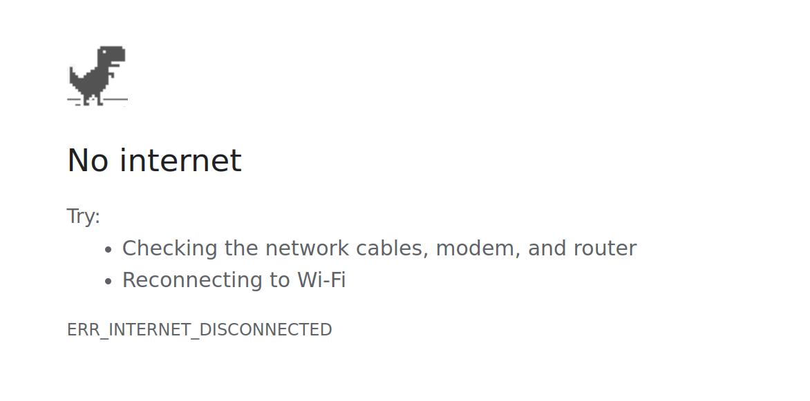

Handling network issues
=======================

Unpoly keeps your application usable as the user's connection becomes [flaky](#flaky-connections) or [goes away entirely](#disconnects).
A failed request never replaces your page with the browser's error screen. Instead you decide what happens:
show a message, offer a retry, or serve pages the user has already visited from the cache.


Disconnects
-----------

In a vanilla HTML document, clicking a link while offline will replace your app with a standard error screen, no questions asked:

{:width='500'}

Interacting with an Unpoly-enhanced [link](/up-follow) or [form](/submitting-forms) while offline will *not* change the page.
Instead Unpoly emits an `up:fragment:offline` event and lets you decide how to handle the connection loss.


### Retrying failed requests {#retrying}

A global listener can offer to retry the failed update by calling `event.retry()`:

```js
up.on('up:fragment:offline', function(event) {
  if (confirm('You are offline. Retry?')) event.retry() // mark: event.retry()
})
```

To handle connection loss for a single link or form, pass an [`{ onOffline }`](/up.render#options.onOffline) option
to the rendering function. The callback receives the same event:

```js
up.follow(link, {
  onOffline(event) {
    if (confirm('You are offline. Retry?')) event.retry()
  }
})
```

In HTML, set an [`[up-on-offline]`](/up-follow#up-on-offline) attribute with a JavaScript snippet:

```html
<a href="/bids" up-follow up-on-offline="alert('You are offline. Please try again later.')"> <!-- mark: up-on-offline -->
  Post bid
</a>
```


### Substituting content {#substituting-content}

Instead of retrying, the listener may also render something else, like an offline notice:

```js
up.on('up:fragment:offline', function(event) {
  up.render(event.renderOptions.target, { content: "You are offline." })
})
```

Requests made with `up.request()` are not rendered, so they emit no `up:fragment:offline` event.
Their promise rejects with an `up.Offline` error, and an `up:request:offline` event is emitted.


### Expired pages remain accessible while offline {#offline-cache}

Even without a connection, [cached content](/caching) remains navigable for [90 minutes](/up.network.config#config.cacheEvictAge).
This means that an offline user can instantly access pages that they already visited this session.

While offline, [cache revalidation](/caching#revalidation) of expired content will fail.

When revalidation fails, or when accessing uncached content, Unpoly runs `onOffline()` callbacks and emits `up:fragment:offline`.
The page will not be changed unless your code says so.


### Preloading links before disconnects

You can use an [`[up-preload="insert"]`](/up-preload#up-preload) attribute
to eagerly preload links as soon as they are inserted into the DOM. This way they remain navigable while offline:

```html
<a href="/menu" up-layer="new drawer" up-preload="insert">≡ Menu</a> <!-- mark: up-preload="insert" -->
```


### Limitations to offline support

While Unpoly lets you handle disconnects, some parts are missing for full "offline" support:

- To fill up the cache the device must be online for the first part of the session (warm start)
- The cache is still in-memory and dies with the browser tab

For a comprehensive offline experience (cold start) we recommend a [service worker](https://web.dev/offline-fallback-page/)
or a canned solution like [UpUp](https://www.talater.com/upup/) (no relation to Unpoly).


Flaky connections
-----------------

Often the device reports a connection, but we're *effectively offline*:

- Smartphone in an EDGE cell
- Car driving into a tunnel
- Overcrowded Wi-Fi with massive packet loss

Unpoly handles flaky connections with *timeouts*. A request that times out also runs `onOffline()` callbacks and emits `up:fragment:offline`.
This means that your [disconnect handling](#disconnects) covers flaky connections as well.

All requests have a [default timeout of 90 seconds](/up.network.config#config.timeout).
You may use different timeouts for individual requests by passing a [`{ timeout }`](/up.render#options.timeout) option
or by setting an [`[up-timeout]`](/up-follow#up-timeout) attribute:

```html
<a href="/report" up-follow up-timeout="10000">Generate report</a> <!-- mark: up-timeout="10000" -->
```


Slow server responses
---------------------

Even with a great connection, your server may take long to render expensive pages.
This is not a network error. The request eventually succeeds, and no `up:fragment:offline` event is emitted.

While the user waits, Unpoly shows an animated [progress bar](/progress-bar) when a request takes
[longer than 400 ms](/up.network.config#config.lateDelay).
You may also show [loading state](/loading-state) within the targeted fragment, like a dimmed element or a placeholder.


HTTP error codes
----------------

When the server responds with an error code (like `500 Server Error`), no `up:fragment:offline` event is emitted.
Instead you can tell Unpoly to [render such responses differently](/failed-responses#fail-options) from a successful response.

By default, [navigation](/navigation-defaults) (like clicking a link or submitting a form) will render an error response's
[main element](/main) in order to convey an error message from the server.

See [Handling failed responses](/failed-responses) for details.


@page network-issues
