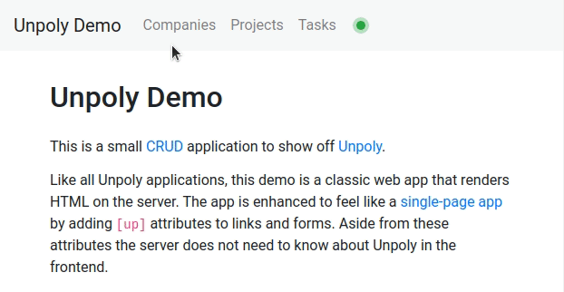

Progress bar
============

When a request takes longer than 400 ms, Unpoly shows a thin progress bar at the top edge of the screen.
This mimics the loading indicator that browsers show during full page loads.



The progress bar requires no setup. You can [style it](#styling), [control when it appears](#timing),
[disable it](#disabling) or replace it with a [custom loading indicator](#custom-implementation).

The progress bar is a global indicator and does not point at the fragment being updated.
To show loading state within a fragment, see [[loading-state]].


## Styling the progress bar {#styling}

The progress bar is implemented as a single `<up-progress-bar>` element.
Unpoly automatically inserts the element when requests are [late](/up:network:late),
and removes it when they have [recovered](/up:network:recover).

By default the bar is 3 pixels high and blue. You may style the element using CSS:

```css
up-progress-bar {
  height: 5px;
  background-color: red;
}
```


## Controlling when the progress bar appears {#timing}

Unpoly shows the progress bar when a request takes longer to respond
than `up.network.config.lateDelay`. The default is 400 milliseconds:

```js
up.network.config.lateDelay = 1000
```

You may override this per request by setting an [`[up-late-delay]`](/up-follow#up-late-delay) attribute
or passing a [`{ lateDelay }`](/up.request#options.lateDelay) option.
Passing `{ lateDelay: false }` never shows a progress bar for that request:

```html
<a href="/report" up-follow up-late-delay="false">Generate report</a> <!-- mark: up-late-delay="false" -->
```

Requests that are loading in the background never show the progress bar.
You can move a request into the background by setting an [`[up-background]`](/up-follow#up-background) attribute
or passing a [`{ background: true }`](/up.render#options.background) option.
Requests from [preloading](/preloading) or [polling](/up-poll) are automatically
marked as background requests.


## Disabling the progress bar {#disabling}

The progress bar can be disabled entirely:

```js
up.network.config.progressBar = false
```


Custom loading indicators {#custom-implementation}
-------------------------

If you don't like the default progress bar, you can observe the `up:network:late`
and `up:network:recover` events to implement a custom
loading indicator that appears during long-running requests.

To build a custom loading indicator, place an element like this in your application layout:

```html
<loading-indicator>Please wait!</loading-indicator>
```

Now add a [compiler](/enhancing-elements) that hides the `<loading-indicator>` element
while there are no long-running requests:

```js
// Disable the default progress bar
up.network.config.progressBar = false

up.compiler('loading-indicator', function(indicator) {
  function show() { up.element.show(indicator) }
  function hide() { up.element.hide(indicator) }

  hide()

  return [
    up.on('up:network:late', show), // mark: up:network:late
    up.on('up:network:recover', hide) // mark: up:network:recover
  ]
})
```

The compiler returns the functions that unbind the event listeners, so the listeners are removed
when the indicator element is [destroyed](/enhancing-elements#destructor).


@page progress-bar
