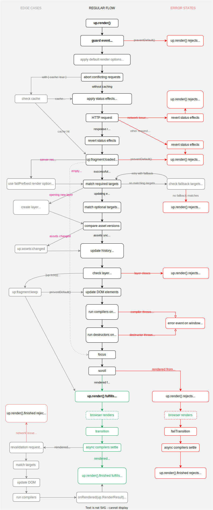

Render lifecycle hooks
======================

You may hook into specific stages of the rendering process in order to change the result or handle error cases.

The techniques below apply to all functions that render, most notably `up.render()`, `up.follow()`, `up.submit()` and `up.reload()`. For brevity we only use `up.render()` in examples. Most callbacks also have an equivalent HTML attribute for use in [links](/a-up-follow) or [forms](/form-up-submit), e.g. `[up-on-loaded]` for `{ onLoaded }`.


## Running code after rendering

Render returns a promise that fulfills when fragments successfully were inserted and [compiled](/up.hello). To run code after fragments were updated, `await` that promise:

```js
await up.render({ url: '/path', target: '.target' })
console.log("Updated fragment is", document.querySelector('.target'))
```

### Awaiting postprocessing

After the `up.render()` promise fulfills the fragments may still change further through [animation](/up.motion) or [revalidation](/caching#revalidation).
To run code when animations have concluded and cached content was revalidated, use the [`up.render().finished`](/up.RenderJob.prototype.finished) promise:

```js
let result = await up.render({ target: '.target', url: '/path' }).finished
console.log("Final fragments: ", result.fragments)
```

The `up.render().finished` promise resolves to the last `up.RenderResult` that updated a fragment.
If revalidation re-rendered the fragment, it is the result from the
second render pass. If no revalidation was performed, or if revalidation yielded an [empty response](/caching#when-nothing-changed),
it is the result from the initial render pass.

The promise rejects when there is any error during the initial render pass or during revalidation.

Instead of awaiting a promise you may also pass an [`{ onFinished }`](/up.render#options.onRendered) callback.\
In HTML you can set an [`[up-on-finished]`](/a-up-follow#up-on-finished) attribute on a [link](/a-up-follow) or [form](/form-up-submit).


### Running code after each render pass

To run code after every render pass, use the [`{ onRendered }`](/up.render#options.onRendered) callback.
This callback may be called zero, one or two times:

- When the server rendered an [empty response](/skipping-rendering#rendering-nothing), no fragments are updated. `{ onRendered }` is not called.
- When the server rendered a matching fragment, it will be updated on the page. `{ onRendered }` is called with the [result](/up.RenderResult).
- When [revalidation](/caching#revalidation) renders a second time, `{ onRendered }` is called again with the final result.

In HTML you can set an [`[up-on-rendered]`](/a-up-follow#up-on-rendered) attribute on a [link](/a-up-follow) or [form](/form-up-submit):

```html
<a
  href="/foo"
  up-target="/target"
  up-on-rendered="console.log('Updated fragment is', document.querySelector('.target'))">
  Click me
</a>
```


## Inspecting the render result

Both `up.render()` and `up.render().finished` promises resolve to an `up.RenderResult` object. You may query this object for the effective results of each render pass:

```js
let result = await up.render({ url: '/path', target: '.target', failTarget: '.errors' })
console.log("Updated layer: ", result.layer)
console.log("Updated fragments: ", result.fragments)
console.log("Effective option used: ", result.options)
```


## Controlling the render process

Functions like `up.render()` and `up.follow()` offer numerous options and [events](/up.event) that allow you to control the render process.

| Intent                                | Hook                                              | Type               |
| ------------------------------------- |---------------------------------------------------| ------------------ |
| Inspect response before rendering     | [`{ onLoaded }`](/up.render#options.onLoaded)     | Callback           |
| Inspect response before rendering     | `up:fragment:loaded`                              | Event              | 
| Modify new elements                   | `up.compiler()`                                   | Component registry |
| Modify new elements                   | [`{ onRendered }`](/up.render#options.onRendered) | Callback           |
| Modify new elements                   | `up:fragment:inserted`                            | Event              |
| Preserve elements within a fragment   | `[up-keep]`                                       | HTML attribute     |
| Control scrolling                     | [`{ scroll }`](/scrolling)                        | Option             |
| Control focus                         | [`{ focus }`](/focus)                             | Option             |
| Control concurrency                   | [`{ abort }`](/aborting-requests)                 | Option             |
| Control concurrency                   | [`{ disable }`](/disabling-forms)                 | Option             |

For a full list of available options see [`up.render() parameters`](/up.render#parameters) and the [lifecycle diagram](#lifecycle-diagram) below.


## Handling errors

The promises returned by `up.render()` and [`up.render().finished`](/up.RenderJob.prototype.finished) reject if any error is thrown during rendering, or if the server responds with an [HTTP error code](/failed-responses).

You may handle the following error cases:

| Error case                                                                         | Hook                                                                           | Type |
|------------------------------------------------------------------------------------|--------------------------------------------------------------------------------| ------- |
| Server responds with [non-200 HTTP status](/failed-responses) | [fail-prefixed options](/failed-responses)                                     | Options |
| Server responds with [non-200 HTTP status](/failed-responses) | `up.RenderResult` (thrown)                                                     | Error |
| Disconnect or timeout                                         | `up.Offline`                                                                   | Error |
| Disconnect or timeout                                         | [`{ onOffline }`](/up.render#options.onOffline)                                | Callback |
| Disconnect or timeout                                         | `up:fragment:offline`                                                          | Event |
| Target selector not found                                     | `up.CannotMatch`                                                               | Error |
| Compiler throws error                                         | [`error`](https://developer.mozilla.org/en-US/docs/Web/API/Window/error_event) | Error |
| Fragment update was [aborted](/aborting-requests)             | `up.AbortError`                                                                | Error |
| Fragment update was [aborted](/aborting-requests)             | `up:fragment:aborted`                                                          | Event |
| Any error thrown while rendering                              | [`{ onError }`](/up.render#options.onError)                                    | Callback |
| Any error thrown while rendering                              | `up.Error`                                                                     | Error superclass |


### Errors in user code

Unpoly functions are generally not interrupted by errors in user code, such as compilers, transitions or callbacks.

When a user-provided function throws an exception, Unpoly instead an emits [`error` event on `window`](https://developer.mozilla.org/en-US/docs/Web/API/Window/error_event).
The operation then succeeds successfully:

```js
window.addEventListener('error', function(event) {
  alert("Got an error " + event.error.name)
})

up.compiler('.element', function() {
  throw new Error('Exception from broken compiler')
})

let element = up.element.affix(document.body, '.element')

up.hello(element) // no error is thrown, but an error event is emitted
```

This behavior is consistent with how the web platform handles [errors in event listeners](https://makandracards.com/makandra/481395-error-handling-in-dom-event-listeners)
and custom elements.

Exceptions in user code are also printed to the browser's [error console](https://developer.mozilla.org/en-US/docs/Web/API/console/error).
This way you can still access the stack trace or [detect JavaScript errors in E2E tests](https://makandracards.com/makandra/55056-raising-javascript-errors-in-ruby-e2e-tests-rspec-cucumber).

Some test runners like [Jasmine](https://jasmine.github.io/) already listen to the `error` event and fail your test if any uncaught exception is observed.
In Jasmine you may use [`jasmine.spyOnGlobalErrorsAsync()`](https://makandracards.com/makandra/559289-jasmine-prevent-unhandled-promise-rejection-from-failing-your-test) to make assertions on the unhandled error.


### Error handling example

To demonstrate control flow in case of error, the code below handles many different error cases:

```js
try {
  window.addEventListener('error', function(event) {
    console.log('Compiler threw error', event.error)
  })
  
  let result = await up.render({
    url: '/path',
    target: '.target',    // selector to replace for 200 OK status
    failTarget: '.errors' // selector to replace for non-200 status
  })
} catch (error) {
  if (error instanceof up.RenderResult) {
    // Server sent HTML with a non-200 status code
    console.log("Updated .errors with", error.fragments)
  } else if (error instanceof up.CannotMatch) {
    console.log("Could not find .target in current page or response")
  } else if (error instanceof up.Aborted) {
    console.log("Request to aborted")
  } else if (error instanceof up.Offline) {
    console.log("Connection loss or timeout")
  } else {
    console.log("Other error while rendering: ", error)
  }
}
```

Note how we use a `fail`-prefixed render option `{ failTarget }` to update a different fragment in case the server responds with an error code. See [handling failed responses](/failed-responses) for more details on handling server responses with an error code.


Preventing a render pass
------------------------

The [render lifecycle](#lifecycle-diagram) emits many events that you can prevent by calling `event.preventDefault()`. When these events are prevented, the render process will abort and no elements will be changed. Focus and scroll positions will be kept. The `up.render()` promise will reject with an `up.AbortError`.

The most important preventable events are:

- `up:link:follow`
- `up:form:submit`
- `up:form:validate`
- `up:fragment:poll`
- `up:fragment:loaded`

> [TIP]
> The last preventable event is `up:fragment:loaded`. It is emitted after a response is loaded but before any elements were changed.

Also see [skipping unnecessary rendering](/skipping-rendering).


Changing options before rendering
---------------------------------

Events like `up:link:follow`, `up:form:submit` and `up:fragment:loaded` allow you to adjust render options by mutating `event.renderOptions`.

The code below will open all form-contained links in an overlay, as to not
lose the user's form data:

```js
up.on('up:link:follow', 'form a', function(event, link) {
  if (link.closest('form')) {
    event.renderOptions.layer = 'new'
  }
})
```

If you have compilers that only set default attributes, consider using a single event listener that manipulates `event.renderOptions`. It's much leaner than a compiler, which needs to be called for every new fragment.
]()
### Advanced example

Assume we give a new attribute `[require-session]` to links that require a signed-in user:

```html
<a href="/projects" require-session>My projects</a>
```

When clicking the link without a session, a login form should open in a [modal overlay](/up.layer). When the user has signed in successfully, the overlay closes and the original link is followed.

We can implement this with the following handler:

```js
up.on('up:link:follow', 'a[require-session]', async function(event) {
  if (!isSignedIn()) {
    // Abort the current render pass
    event.preventDefault()

    // Wait until the user has signed in in a modal
    await up.layer.ask('/session/new', { acceptLocation: '/welcome' })

    // Start a new render pass with the original render pass
    up.render(event.renderOptions)
  }
})
```


Lifecycle diagram
-----------------

The diagram below attempts to visualize the sequence of render steps, edge cases and error states.

{:width='900'}

@page render-hooks
