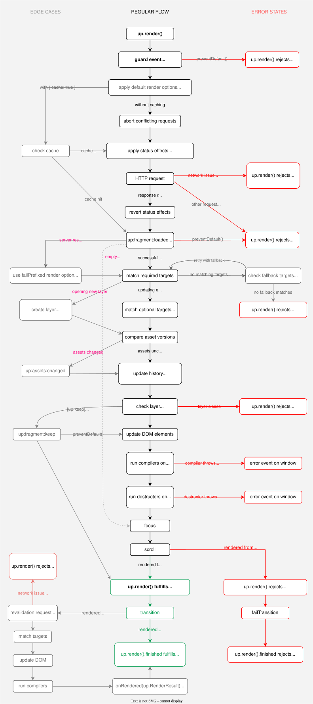

Render lifecycle
================

Every render pass moves through the same stages: a request is sent, a response is loaded,
fragments are swapped, then animations and cache revalidation settle.
Your code can hook into each stage to run code after rendering, change render options on the fly,
skip a response, or handle errors.

The techniques below apply to all functions and attributes that render, most notably `up.render()`, `[up-follow]` and `[up-submit]`.
For brevity we only use `up.render()` in examples.


Lifecycle diagram
-----------------

The diagram below visualizes the sequence of render steps, edge cases and error states:

{:width='900'}

Each stage has an option or event to hook into. Many of them are explained on this page.
The others have a page of their own:

| Intent                              | JavaScript                                                | HTML                                            |
|-------------------------------------|-----------------------------------------------------------|-------------------------------------------------|
| Intervene on interaction            | Guard events like<br>`up:link:follow` or `up:form:submit` | —                                               |
| Control concurrency                 | [`{ abort }`](/aborting-requests)                         | [`[up-abort]`](/aborting-requests)              |
| Control concurrency                 | [`{ abortable }`](/aborting-requests)                     | [`[up-abortable]`](/aborting-requests)          |
| Change page during request          | [`{ disable }`](/disabling-forms)                         | [`[up-disable]`](/disabling-forms)              |
| Change page during request          | [`{ placeholder }`](/placeholders)                        | [`[up-placeholder]`](/placeholders)             |
| Change page during request          | [`{ preview }`](/previews)                                | [`[up-preview]`](/previews)                     |
| Intervene before rendering          | [`{ onLoaded }`](/up.render#options.onLoaded)             | [`[up-on-loaded]`](/up-follow#up-on-loaded)     |
| Intervene before rendering          | `up:fragment:loaded`                                      | —                                               |
| Modify new elements                 | [`{ onRendered }`](/up.render#options.onRendered)         | [`[up-on-rendered]`](/up-follow#up-on-rendered) |
| Modify new elements                 | `up.compiler()`                                           | —                                               |
| Modify new elements                 | `up:fragment:inserted`                                    | —                                               |
| Preserve elements within a fragment | [`{ keep }`](/up.render#options.keep)                     | `[up-keep]`                                     |
| Control scrolling                   | [`{ scroll }`](/scrolling)                                | [`[up-scroll]`](/scrolling)                     |
| Control focus                       | [`{ focus }`](/focus)                                     | [`[up-focus]`](/focus)                          |

For a full list of available options see [`up.render()` parameters](/up.render#parameters).


Running code after rendering
----------------------------

Rendering functions return a promise that fulfills when fragments were inserted and [compiled](/up.hello).
To run code after fragments were updated, `await` that promise:

```js
await up.render({ url: '/path', target: '.target' })
console.log("Updated fragment is", document.querySelector('.target'))
```

The promise rejects when there is a [network issue](/network-issues),
or if the server [responds with an HTTP error code](/failed-responses). See [Handling errors](#handling-errors).


### Inspecting the render result

The promise resolves to an `up.RenderResult` object describing the effects of the render pass:

```js
let result = await up.render({ url: '/path', target: '.target', failTarget: '.errors' })
console.log("Updated layer: ", result.layer)
console.log("Updated fragments: ", result.fragments)
console.log("Effective options used: ", result.renderOptions)
```

When the pass updated a single fragment, `result.fragment` returns it directly.


### Running code after each render pass

To run code after every render pass, pass an [`{ onRendered }`](/up.render#options.onRendered) callback.
This callback may be called zero, one or two times:

- When the server rendered an [empty response](/conditional-requests#rendering-nothing), no fragments are updated. `{ onRendered }` is not called.
- When the server rendered a matching fragment, it is updated on the page. `{ onRendered }` is called with the [result](/up.RenderResult).
- When [revalidation](/caching#revalidation) renders a second time, `{ onRendered }` is called again with the final result.

In HTML you can set an [`[up-on-rendered]`](/up-follow#up-on-rendered) attribute on a [link](/up-follow) or [form](/submitting-forms):

```html
<a
  href="/foo"
  up-target=".target"
  up-on-rendered="console.log('Updated fragment is', document.querySelector('.target'))"> <!-- mark-line -->
  Click me
</a>
```


### Awaiting postprocessing {#postprocessing}

After the `up.render()` promise fulfills, fragments may still change due to asynchronous postprocessing.
To run code after postprocessing has concluded, await the [`up.render().finished`](/up.RenderJob.prototype.finished) promise:

```js
let result = await up.render({ target: '.target', url: '/path' }).finished // mark: .finished
console.log("Final fragments: ", result.fragments)
```

@include finished-state

The `up.render().finished` promise resolves to the last `up.RenderResult` that updated a fragment.
If revalidation re-rendered the fragment, it is the result from the
second render pass. If no revalidation was performed, or if revalidation yielded an [empty response](/caching#when-nothing-changed),
it is the result from the initial render pass.

The promise rejects when there is any error during the initial render pass or during revalidation.

Instead of awaiting a promise you may also pass an [`{ onFinished }`](/up.render#options.onFinished) callback.
In HTML you can set an [`[up-on-finished]`](/up-follow#up-on-finished) attribute on a [link](/up-follow) or [form](/submitting-forms).


Changing options before rendering
---------------------------------

Events like `up:link:follow`, `up:form:submit` and `up:fragment:loaded` carry the options of the
coming render pass as `event.renderOptions`. Listeners may change these options before they take effect.

The code below opens all links within a form in an overlay, so the user's form data is not lost:

```js
up.on('up:link:follow', 'form a', function(event) {
  event.renderOptions.layer = 'new' // mark-line
})
```

If you have compilers that only set default attributes, consider using a single event listener that manipulates `event.renderOptions`.
It's much leaner than a compiler, which needs to run for every new fragment.

The `up:fragment:loaded` event is emitted after the server has responded, but before the response is rendered.
Here you can inspect the response and change how it is rendered. The example below renders the main target
when the server flags the response with a header:

```js
up.on('up:fragment:loaded', function(event) {
  if (event.response.header('X-Course-Completed')) {
    event.renderOptions.target = ':main' // mark-line
  }
})
```

### Deferring a render pass {#deferring}

A listener can also abort a render pass, do something else, and restart it later with the original options.
Assume we give a new attribute `[require-session]` to links that require a signed-in user:

```html
<a href="/projects" require-session>My projects</a>
```

When clicking the link without a session, a login form should open in a [modal overlay](/up.layer).
When the user has signed in successfully, the overlay closes and the original link is followed.

We can implement this with the following handler:

```js
up.on('up:link:follow', 'a[require-session]', async function(event) {
  if (!isSignedIn()) {
    // Abort the current render pass
    event.preventDefault()

    // Wait until the user has signed in in a modal
    await up.layer.ask('/session/new', { acceptLocation: '/welcome' })

    // Start a new render pass with the original render options
    up.render(event.renderOptions)
  }
})
```


Preventing a render pass
------------------------

The [render lifecycle](#lifecycle-diagram) emits many events that you can prevent by calling `event.preventDefault()`.
When an event is prevented, the render pass aborts and no elements are changed.
Focus and scroll positions are kept. The `up.render()` promise rejects with an `up.Aborted` error.

The most important preventable events are:

- `up:link:follow`
- `up:form:submit`
- `up:form:validate`
- `up:fragment:poll`
- `up:fragment:loaded`

The last chance to prevent a render pass is `up:fragment:loaded`.
It is emitted after a response was loaded, but before any elements are changed.


### Skipping a loaded response {#skipping-responses}

Even after the server has sent a response, you may decide not to render it.
Call `event.skip()` on the `up:fragment:loaded` event to finish the render pass without changes.
The example below skips responses that the server has flagged as unchanged:

```js
up.on('up:fragment:loaded', function(event) {
  if (event.response.header('X-Unchanged')) {
    event.skip() // mark-line
  }
})
```

A skipped render pass is not an error. The `up.render()` promise fulfills with an
[empty](/up.RenderResult.prototype.none) `up.RenderResult`, and no `{ onRendered }` callback is called.

To skip responses by a global rule instead of an event listener, configure `up.fragment.config.skipResponse`.
By default Unpoly skips the following responses:

- Responses without text in their body.
  Such responses occur when a [conditional request](/conditional-requests)
  is answered with HTTP status `304 Not Modified` or `204 No Content`.
- When [revalidating](/caching#revalidation), if the expired response and fresh response
  have the exact same text.

To abort the render pass instead, call `event.preventDefault()`.
The `up.render()` promise then rejects with an `up.Aborted` error.
The example below shows an alert instead of rendering the response:

```js
up.on('up:fragment:loaded', function(event) {
  if (event.response.header('X-User-Created')) {
    // Abort the render pass
    event.preventDefault() // mark-line

    // Show an alert instead
    alert('The user was created successfully')
  }
})
```

Preventing `up:fragment:loaded` is also the way to escape to a full page load when the server
responds with an entirely different layout, like a maintenance page:

```js
up.on('up:fragment:loaded', function(event) {
  if (event.response.header('X-Maintenance')) {
    event.preventDefault() // mark-line
    event.request.loadPage()
  }
})
```

See `up:fragment:loaded` for more examples.


Handling errors
---------------

The promises returned by `up.render()` and [`up.render().finished`](/up.RenderJob.prototype.finished) reject if any error is thrown during rendering, or if the server responds with an [HTTP error code](/failed-responses).

You may handle the following error cases:

| Error case                                                    | JavaScript                                                                                  | HTML                                                                 |
|---------------------------------------------------------------|---------------------------------------------------------------------------------------------|----------------------------------------------------------------------|
| Server responds with [non-2xx HTTP status](/failed-responses) | [`fail`-prefixed options](/failed-responses)                                                | [`up-fail`-prefixed attributes](/failed-responses)                   |
| Server responds with [non-2xx HTTP status](/failed-responses) | `up.RenderResult` (thrown)                                                                  | —                                                                    |
| Disconnect or timeout                                         | [`{ onOffline }`](/network-issues)                                                          | [`[up-on-offline]`](/network-issues)                                 |
| Disconnect or timeout                                         | `up.Offline` (thrown)                                                                       | —                                                                    |
| Disconnect or timeout                                         | `up:fragment:offline`                                                                       | —                                                                    |
| Target selector not found                                     | [`{ fallback }`](/targeting-fragments#missing-targets)                                      | [`[up-fallback]`](/targeting-fragments#missing-targets)              |
| Target selector not found                                     | `up.CannotMatch` (thrown)                                                                   | —                                                                    |
| Compiler throws error                                         | Global [`error`](https://developer.mozilla.org/en-US/docs/Web/API/Window/error_event) event | —                                                                    |
| Fragment update was [aborted](/aborting-requests)             | `up.Aborted` (thrown)                                                                       | —                                                                    |
| Fragment update was [aborted](/aborting-requests)             | `up:fragment:aborted`                                                                       | —                                                                    |
| Any error thrown while rendering                              | [`{ onError }`](/up.render#options.onError)                                                 | [`[up-on-error]`](/up-follow#up-on-error)                            |

A failed response is rendered with `fail`-prefixed options and then *rejects* the promise with its `up.RenderResult`.
It does not count as an error for `{ onError }`. To run code after a failed response was rendered,
pass an [`{ onFailRendered }`](/failed-responses#fail-options) callback.


### Error handling example

To demonstrate control flow in case of error, the code below handles many different error cases:

```js
try {
  window.addEventListener('error', function(event) {
    console.log('Compiler threw error', event.error)
  })

  let result = await up.render({
    url: '/path',
    target: '.target',    // selector to replace for 2xx status
    failTarget: '.errors' // selector to replace for non-2xx status
  })
} catch (error) {
  if (error instanceof up.RenderResult) {
    // Server sent HTML with a non-2xx status code
    console.log("Updated .errors with", error.fragments)
  } else if (error instanceof up.CannotMatch) {
    console.log("Could not find .target in current page or response")
  } else if (error instanceof up.Aborted) {
    console.log("Request was aborted")
  } else if (error instanceof up.Offline) {
    console.log("Connection loss or timeout")
  } else {
    console.log("Other error while rendering: ", error)
  }
}
```

Note how we use a `fail`-prefixed render option `{ failTarget }` to update a different fragment in case the server responds with an error code.
See [Handling failed responses](/failed-responses) for more details on handling server responses with an error code.


### Errors in user code

Unpoly functions are generally not interrupted by errors in user code, such as compilers, transitions or callbacks.

When a user-provided function throws an exception, Unpoly instead emits an [`error` event on `window`](https://developer.mozilla.org/en-US/docs/Web/API/Window/error_event).
The operation then finishes as if no error had been thrown:

```js
up.compiler('.element', () => { throw new Error('broken compiler') })
let element = up.element.affix(document.body, '.element')
up.hello(element) // no error is thrown
```

This behavior is consistent with how the web platform handles [errors in event listeners](https://makandracards.com/makandra/481395-error-handling-in-dom-event-listeners)
and custom elements.


#### Debugging and testing

Exceptions in user code are also logged to the browser's [error console](https://developer.mozilla.org/en-US/docs/Web/API/console/error).
This way you can still access the stack trace or [detect JavaScript errors in E2E tests](https://makandracards.com/makandra/55056-raising-javascript-errors-in-ruby-e2e-tests-rspec-cucumber).

Some test runners like [Jasmine](https://jasmine.github.io/) already listen to the `error` event and fail your test if any uncaught exception is observed.
In Jasmine you may use [`jasmine.spyOnGlobalErrorsAsync()`](https://makandracards.com/makandra/559289-jasmine-prevent-unhandled-promise-rejection-from-failing-your-test) to make assertions on the unhandled error.


@page render-lifecycle
