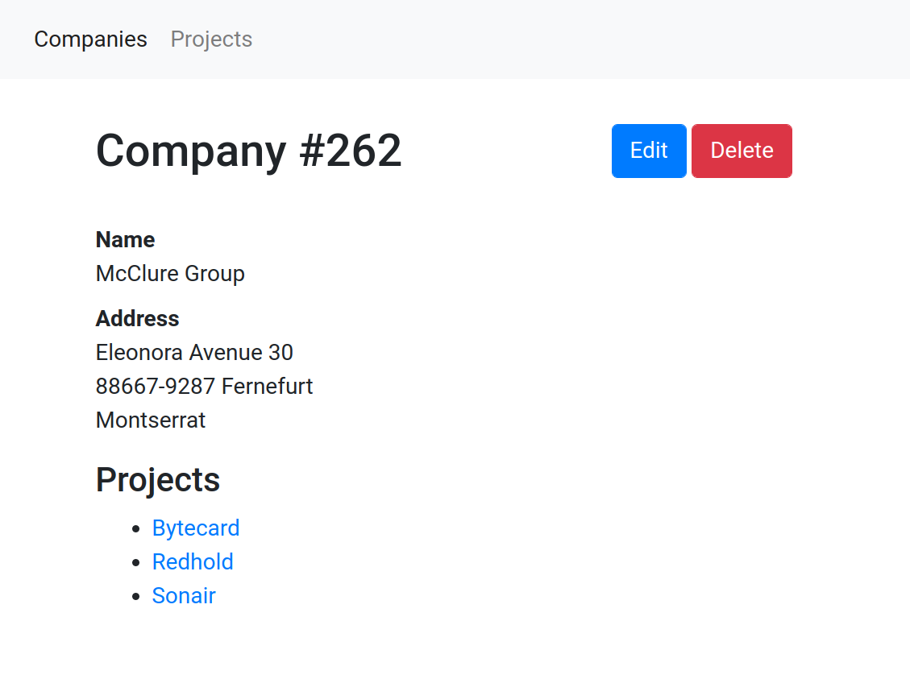
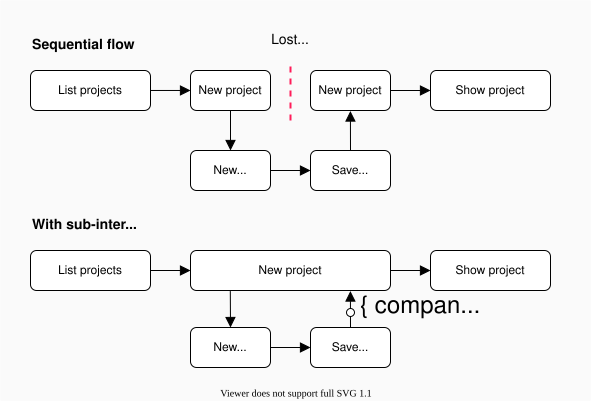

Subinteractions
===============

A subinteraction is a task the user completes in an overlay, while the original screen
stays open behind it. When the task is done, the overlay closes and passes a result value
back to the original screen, which continues where the user left off. The overlay
can show any existing screen of your app, without that screen knowing it is embedded.


Example
-------

Imagine an application that manages *projects* and *companies*:

- Each project is associated with a company.
- Each company may have multiple projects.
- The application has [CRUD interfaces](https://en.wikipedia.org/wiki/CRUD) for projects and companies.

{:width='500'}

With a sequential screen flow, a missing company breaks the user's work:

- The user starts filling in the form for a new project.
- To create a project, the user must select a company. But the desired company does not exist yet.
- The user must abandon the half-completed project form to create the missing company.
  **All entered project data is lost.**
- After creating the company, the user returns to the project form
  and enters the lost data again.

With a *subinteraction*, the project form stays open:

- The user starts filling in the form for a new project.
- To create a project, the user must select a company. But the desired company does not exist yet.
- The user opens an overlay to create the missing company.\
  **The unfinished project form remains open in the background.**
- When the company is created in the overlay, the overlay closes.\
  The project form now has the new company selected.

The diagram shows the difference between the two control flows:

{:width='600'}


Starting a subinteraction
-------------------------

To start a subinteraction, open an overlay with a [close condition](/closing-overlays#close-conditions)
and an acceptance callback:

```html
<a href="/companies/new"
  up-layer="new"
  up-accept-location="/companies/$id"
  up-on-accepted="up.reload('.company-list')"> <!-- mark: up-on-accepted -->
  New company
</a>

<div class="company-list">
  ...
</div>
```

When the user submits the company form and the server redirects to the new company's URL
(like `/companies/123`), the overlay is accepted automatically. The callback then reloads
the list behind the overlay.

The overlay can show any screen of your app. It takes no part in ending the subinteraction:
the link that opened the overlay defines when the task is done, and what happens then.


Working with result values {#result-values}
--------------------------

When an overlay is accepted, it passes a *result value* to the layer that opened it.
Where the value comes from depends on how the overlay was closed:

| Overlay is accepted by                                                        | Acceptance value                                  |
|-------------------------------------------------------------------------------|---------------------------------------------------|
| Reaching a [location](/closing-overlays#location-condition) like `/companies/$id` | The captured segments, e.g. `{ id: 123 }`     |
| An [event](/closing-overlays#event-condition) like `company:created`          | The event object                                  |
| A [fragment](/closing-overlays#fragment-condition) like `.company-profile`    | The fragment's [data](/data)                      |
| A button with [`[up-accept="{ id: 123 }"]`](/closing-overlays#on-click)       | The attribute's [relaxed JSON](/relaxed-json) value |
| A form with [`[up-accept]`](/closing-overlays#on-submit)                      | The form's params as an `up.Params` object        |

In an `[up-on-accepted]` attribute, the value is available as `value`:

```html
<a href="/companies/new"
  up-layer="new"
  up-accept-location="/companies/$id"
  up-on-accepted="console.log('Company ID is', value.id)"> <!-- mark: value.id -->
  New company
</a>
```

An `{ onAccepted }` callback receives it as `event.value`:

```js
up.layer.open({
  url: '/companies/new',
  acceptLocation: '/companies/$id',
  onAccepted: (event) => console.log('Company ID is', event.value.id) // mark: event.value.id
})
```

When the user cancels the subinteraction, the overlay is *dismissed* instead.
Dismissal also carries a value, which indicates the [reason for dismissal](/closing-overlays#dismissal-reasons).
A subinteraction is usually interested in acceptance only.


Common acceptance callbacks
---------------------------

### Reloading on acceptance

The most common callback reloads an element in the parent layer with `up.reload()`,
as in the [example above](#starting-a-subinteraction).

Sometimes the response that accepted the overlay already contains the HTML to update
the element. In that case, render `event.response` instead of making another request:

```html
<a href="/companies/new"
  up-layer="new"
  up-accept-location="/companies"
  up-on-accepted="up.render('.company-list', { response: event.response })"> <!-- mark: { response: event.response } -->
  New company
</a>
```

See [[closing-overlays#using-the-discarded-response]].


### Adding options to an existing select

Another common callback reloads the options of a `<select>` and selects the new record:

```html
<select name="company">...</select>

<a href="/companies/new"
  up-layer="new"
  up-accept-location="/companies/$id"
  up-on-accepted="up.validate('select', { params: { company: value.id } })"> <!-- mark-line -->
  New company
</a>
```

This uses `up.validate()` to re-render the select from the server, as if the user
had already picked the new company. The form is not saved by this.


### Navigating away

You may also want to navigate to a new screen once the overlay was accepted:

```html
<a href="/companies/new"
  up-layer="new"
  up-accept-location="/companies/$id"
  up-on-accepted="up.navigate({ url: '/projects/new?company_id=' + value.id })"> <!-- mark-line -->
  New company
</a>
```


Reusing existing screens
------------------------

The company form in the examples above is the regular form from your companies CRUD.
It has no idea that it is sometimes opened from a project form, and it needs no changes for this.
The link that opens the overlay carries the acceptance condition and the callback,
so the same form works on its own, in an overlay, and in a new tab.

This works because [layers are isolated](/overlays#layers-are-isolated): the form in the overlay
re-renders within that overlay, even when the project form behind it has elements with the same selectors.

Some screens have an element that should close the overlay, but still make sense on a full page.
A *Finish* link can [close the overlay when followed](/closing-overlays#on-follow), and navigate
to its `[href]` when clicked on the root layer:

```html
<a href="/companies" up-accept>Finish</a> <!-- mark: up-accept -->
```

A form with an `[up-accept]` attribute closes the overlay [when submitted](/closing-overlays#on-submit),
and makes a regular submission when it is not in an overlay.

To vary a reused screen slightly, like showing "Pick a company for project Foo" in the overlay only,
pass data to the overlay with [[context]].


Awaiting subinteractions from JavaScript {#awaiting-subinteractions-from-javascript}
----------------------------------------

Instead of passing callbacks to `up.layer.open()`, you can use `up.layer.ask()`.
It returns a promise for the [acceptance value](#result-values), which you can `await`:

```js
let company = await up.layer.ask({ url: '/companies/new', acceptLocation: '/companies/$id' })
console.log('New company ID is', company.id)
```

When the overlay is dismissed instead of accepted, the promise rejects with the
[dismissal reason](/closing-overlays#dismissal-reasons). You can `catch` it to handle a canceled subinteraction:

```js
try {
  let company = await up.layer.ask({ url: '/companies/new', acceptLocation: '/companies/$id' })
  console.log('New company ID is', company.id)
} catch (reason) {
  console.error('No company was created:', reason)
}
```


@page subinteractions
@signature
